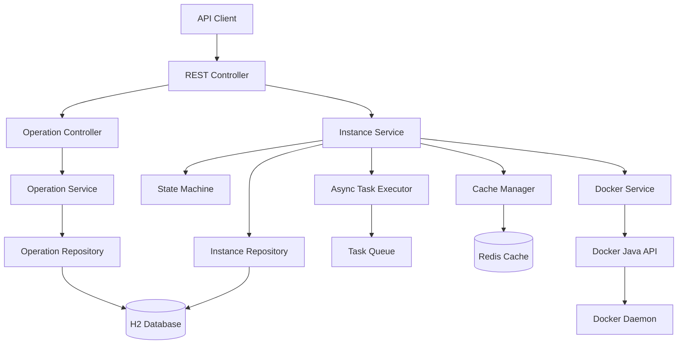

# Design Document

## Overview

本系統設計一個 RESTful API 服務，模擬 AWS EC2 的狀態管理行為，但底層操作 Docker containers。系統採用 Spring Boot 3.x 框架，使用 Java 17 開發，透過 Gradle 進行建置管理。

核心設計理念：
- 提供與 AWS EC2 相似的 API 介面和狀態管理
- 底層透過 Docker Java API 操作 containers
- 實現完整的狀態機制確保操作一致性
- 支援並發操作和錯誤恢復
- 採用非同步機制處理長時間運行的操作
- 實現分頁和快取機制提升查詢效能
- 提供操作追蹤和進度查詢功能

## Architecture

### 系統架構圖



### 分層架構

1. **Presentation Layer (REST Controller)**
   - 處理 HTTP 請求和回應
   - 參數驗證和格式轉換
   - 錯誤處理和狀態碼映射
   - 分頁參數處理和回應格式化

2. **Business Logic Layer (Service)**
   - 實現業務邏輯和狀態管理
   - 協調 Docker 操作和資料庫更新
   - 狀態機制的實現
   - 非同步任務管理和操作追蹤

3. **Data Access Layer (Repository)**
   - 資料持久化操作
   - Instance 資訊的 CRUD 操作
   - 分頁查詢和排序支援

4. **Integration Layer (Docker Service)**
   - Docker API 的封裝和抽象
   - Container 生命週期管理

5. **Cache Layer (Cache Manager)**
   - 快取策略實現
   - 快取失效和更新機制
   - 分散式快取支援

6. **Async Processing Layer (Task Executor)**
   - 非同步任務執行
   - 任務佇列管理
   - 操作狀態追蹤

## Components and Interfaces

### 1. REST Controllers

#### Instance Controller
```java
@RestController
@RequestMapping("/api/v1/instances")
public class InstanceController {
    
    @PostMapping
    public ResponseEntity<AsyncOperationResponse> createInstance(@RequestBody CreateInstanceRequest request);
    
    @GetMapping("/{id}")
    @Cacheable(value = "instances", key = "#id")
    public ResponseEntity<InstanceResponse> getInstance(@PathVariable String id);
    
    @GetMapping
    @Cacheable(value = "instancesList", key = "#pageable.toString()")
    public ResponseEntity<PagedResponse<InstanceResponse>> listInstances(
        @PageableDefault(size = 20, sort = "createdAt", direction = Sort.Direction.DESC) Pageable pageable,
        @RequestParam(required = false) String state,
        @RequestParam(required = false) String imageId
    );
    
    @PostMapping("/{id}/start")
    public ResponseEntity<AsyncOperationResponse> startInstance(@PathVariable String id);
    
    @PostMapping("/{id}/stop")
    public ResponseEntity<AsyncOperationResponse> stopInstance(@PathVariable String id);
    
    @PostMapping("/{id}/restart")
    public ResponseEntity<AsyncOperationResponse> restartInstance(@PathVariable String id);
    
    @DeleteMapping("/{id}")
    public ResponseEntity<AsyncOperationResponse> terminateInstance(@PathVariable String id);
}
```

#### Operation Controller
```java
@RestController
@RequestMapping("/api/v1/operations")
public class OperationController {
    
    @GetMapping("/{operationId}")
    public ResponseEntity<OperationResponse> getOperation(@PathVariable String operationId);
    
    @GetMapping
    public ResponseEntity<PagedResponse<OperationResponse>> listOperations(
        @PageableDefault(size = 20, sort = "createdAt", direction = Sort.Direction.DESC) Pageable pageable,
        @RequestParam(required = false) String status,
        @RequestParam(required = false) String instanceId
    );
}
```

### 2. Services

#### Instance Service
```java
@Service
public class InstanceService {
    
    // 非同步操作方法
    public AsyncOperation createInstanceAsync(CreateInstanceRequest request);
    public AsyncOperation startInstanceAsync(String instanceId);
    public AsyncOperation stopInstanceAsync(String instanceId);
    public AsyncOperation restartInstanceAsync(String instanceId);
    public AsyncOperation terminateInstanceAsync(String instanceId);
    
    // 同步查詢方法
    @Cacheable(value = "instances", key = "#instanceId")
    public Instance getInstance(String instanceId);
    
    public Page<Instance> listInstances(Pageable pageable, String state, String imageId);
    
    // 狀態管理方法
    @CacheEvict(value = "instances", key = "#instanceId")
    private void transitionState(String instanceId, InstanceState targetState);
    private boolean canTransition(InstanceState currentState, InstanceState targetState);
    
    // 狀態同步和清理方法
    @Scheduled(fixedRate = 30000) // 每30秒執行一次
    public void syncInstanceStates();
    
    @Scheduled(fixedRate = 300000) // 每5分鐘執行一次
    private void cleanupTerminatedInstances();
    
    // 狀態恢復方法
    @PostConstruct
    public void recoverInstanceStates();
}
```

#### Operation Service
```java
@Service
public class OperationService {
    
    public AsyncOperation createOperation(String instanceId, OperationType type);
    public AsyncOperation getOperation(String operationId);
    public Page<AsyncOperation> listOperations(Pageable pageable, String status, String instanceId);
    public void updateOperationStatus(String operationId, OperationStatus status, String message);
    public void completeOperation(String operationId, Object result);
    public void failOperation(String operationId, String errorMessage);
    
    @Scheduled(fixedRate = 600000) // 每10分鐘執行一次
    private void cleanupCompletedOperations();
}
```

#### Async Task Service
```java
@Service
public class AsyncTaskService {
    
    @Async("taskExecutor")
    public CompletableFuture<Void> executeCreateInstance(String operationId, CreateInstanceRequest request);
    
    @Async("taskExecutor")
    public CompletableFuture<Void> executeStartInstance(String operationId, String instanceId);
    
    @Async("taskExecutor")
    public CompletableFuture<Void> executeStopInstance(String operationId, String instanceId);
    
    @Async("taskExecutor")
    public CompletableFuture<Void> executeRestartInstance(String operationId, String instanceId);
    
    @Async("taskExecutor")
    public CompletableFuture<Void> executeTerminateInstance(String operationId, String instanceId);
}
```

### 3. Docker Service

```java
@Service
public class DockerService {
    
    public String createContainer(ContainerConfig config);
    public void startContainer(String containerId);
    public void stopContainer(String containerId);
    public void restartContainer(String containerId);
    public void removeContainer(String containerId);
    public ContainerInfo getContainerInfo(String containerId);
    public boolean isContainerRunning(String containerId);
}
```

### 4. State Machine

```java
@Component
public class InstanceStateMachine {
    
    private static final Map<InstanceState, Set<InstanceState>> VALID_TRANSITIONS = Map.of(
        PENDING, Set.of(RUNNING, ERROR),
        RUNNING, Set.of(STOPPING, REBOOTING, TERMINATING),
        STOPPING, Set.of(STOPPED, ERROR),
        STOPPED, Set.of(PENDING, TERMINATING),
        REBOOTING, Set.of(RUNNING, ERROR),
        ERROR, Set.of(TERMINATING),
        TERMINATING, Set.of(TERMINATED, ERROR),
        TERMINATED, Set.of() // 最終狀態，無法轉換
    );
    
    public boolean canTransition(InstanceState from, InstanceState to);
    public void validateTransition(InstanceState from, InstanceState to);
    public Set<InstanceState> getValidNextStates(InstanceState currentState);
    public boolean isTerminalState(InstanceState state);
}
```

## Data Models

### Instance Entity

```java
@Entity
@Table(name = "instances")
public class Instance {
    
    @Id
    private String instanceId;
    
    @Column(nullable = false)
    private String containerId;
    
    @Enumerated(EnumType.STRING)
    @Column(nullable = false)
    private InstanceState state;
    
    @Column(nullable = false)
    private String imageId;
    
    @Column(nullable = false)
    private LocalDateTime createdAt;
    
    @Column
    private LocalDateTime lastStateChange;
    
    @Column
    private String errorMessage;
    
    // getters, setters, constructors
}
```

### Instance State Enum

```java
public enum InstanceState {
    PENDING("pending"),
    RUNNING("running"),
    STOPPING("stopping"),
    STOPPED("stopped"),
    REBOOTING("rebooting"),
    TERMINATING("terminating"),
    TERMINATED("terminated"),
    ERROR("error");
    
    private final String value;
    
    InstanceState(String value) {
        this.value = value;
    }
    
    public String getValue() {
        return value;
    }
    
    public boolean isTerminal() {
        return this == TERMINATED;
    }
}
```

### Operation Entity

```java
@Entity
@Table(name = "operations")
public class AsyncOperation {
    
    @Id
    private String operationId;
    
    @Column(nullable = false)
    private String instanceId;
    
    @Enumerated(EnumType.STRING)
    @Column(nullable = false)
    private OperationType type;
    
    @Enumerated(EnumType.STRING)
    @Column(nullable = false)
    private OperationStatus status;
    
    @Column(nullable = false)
    private LocalDateTime createdAt;
    
    @Column
    private LocalDateTime completedAt;
    
    @Column
    private String errorMessage;
    
    @Column
    private String result;
    
    // getters, setters, constructors
}
```

### Operation Enums

```java
public enum OperationType {
    CREATE("create"),
    START("start"),
    STOP("stop"),
    RESTART("restart"),
    TERMINATE("terminate");
    
    private final String value;
    
    OperationType(String value) {
        this.value = value;
    }
}

public enum OperationStatus {
    IN_PROGRESS("in_progress"),
    COMPLETED("completed"),
    FAILED("failed");
    
    private final String value;
    
    OperationStatus(String value) {
        this.value = value;
    }
}
```

### DTOs

```java
// Request DTOs
public record CreateInstanceRequest(
    @NotBlank String imageId,
    Map<String, String> environment,
    List<String> command
) {}

// Response DTOs
public record InstanceResponse(
    String instanceId,
    String state,
    String imageId,
    LocalDateTime createdAt,
    LocalDateTime lastStateChange,
    ContainerInfo containerInfo
) {}

public record ContainerInfo(
    String containerId,
    String status,
    Map<String, Object> ports
) {}

public record AsyncOperationResponse(
    String operationId,
    String instanceId,
    String type,
    String status,
    LocalDateTime createdAt,
    String message
) {}

public record OperationResponse(
    String operationId,
    String instanceId,
    String type,
    String status,
    LocalDateTime createdAt,
    LocalDateTime completedAt,
    String errorMessage,
    String result
) {}

public record PagedResponse<T>(
    List<T> content,
    int page,
    int size,
    long totalElements,
    int totalPages,
    boolean first,
    boolean last
) {}
```

## Error Handling

### 異常處理策略

1. **業務邏輯異常**
   - `InstanceNotFoundException`: Instance 不存在
   - `InvalidStateTransitionException`: 無效的狀態轉換
   - `DockerOperationException`: Docker 操作失敗

2. **全域異常處理器**

```java
@RestControllerAdvice
public class GlobalExceptionHandler {
    
    @ExceptionHandler(InstanceNotFoundException.class)
    public ResponseEntity<ErrorResponse> handleInstanceNotFound(InstanceNotFoundException ex) {
        return ResponseEntity.status(HttpStatus.NOT_FOUND)
            .body(new ErrorResponse("INSTANCE_NOT_FOUND", ex.getMessage()));
    }
    
    @ExceptionHandler(InvalidStateTransitionException.class)
    public ResponseEntity<ErrorResponse> handleInvalidStateTransition(InvalidStateTransitionException ex) {
        return ResponseEntity.status(HttpStatus.CONFLICT)
            .body(new ErrorResponse("INVALID_STATE_TRANSITION", ex.getMessage()));
    }
    
    @ExceptionHandler(DockerOperationException.class)
    public ResponseEntity<ErrorResponse> handleDockerOperation(DockerOperationException ex) {
        return ResponseEntity.status(HttpStatus.INTERNAL_SERVER_ERROR)
            .body(new ErrorResponse("DOCKER_OPERATION_FAILED", ex.getMessage()));
    }
}
```

### 錯誤回應格式

```java
public record ErrorResponse(
    String errorCode,
    String message,
    LocalDateTime timestamp
) {
    public ErrorResponse(String errorCode, String message) {
        this(errorCode, message, LocalDateTime.now());
    }
}
```

## Testing Strategy

### 1. 單元測試
- Service 層業務邏輯測試
- State Machine 狀態轉換測試
- Docker Service 操作測試（使用 Mock）

### 2. 整合測試
- Repository 層資料庫操作測試
- Docker 整合測試（使用 Testcontainers）
- API 端點整合測試

### 3. 測試工具和框架
- JUnit 5 for 單元測試
- Mockito for Mock 物件
- Testcontainers for Docker 整合測試
- Spring Boot Test for 整合測試
- WireMock for 外部服務模擬

### 4. 測試策略
- 使用 @DataJpaTest 測試 Repository 層
- 使用 @WebMvcTest 測試 Controller 層
- 使用 @SpringBootTest 進行完整整合測試
- 實現測試資料的自動清理機制

## 技術決策和考量

### 1. 資料庫選擇
- 開發環境使用 H2 in-memory database
- 生產環境可配置為 PostgreSQL 或 MySQL
- 使用 JPA/Hibernate 進行 ORM 映射

### 2. Docker 整合
- 使用 Docker Java API 客戶端
- 實現連接池管理 Docker 連接
- 支援本地和遠端 Docker daemon

### 3. 並發處理
- 使用樂觀鎖防止狀態競爭
- 實現重試機制處理暫時性失敗
- 使用 @Async 處理長時間運行的操作

### 4. 配置管理
- 使用 Spring Boot Configuration Properties
- 支援不同環境的配置檔案
- 實現敏感資訊的加密存儲

### 5. 監控和日誌
- 使用 SLF4J + Logback 進行日誌記錄
- 實現結構化日誌輸出
- 整合 Spring Boot Actuator 提供健康檢查