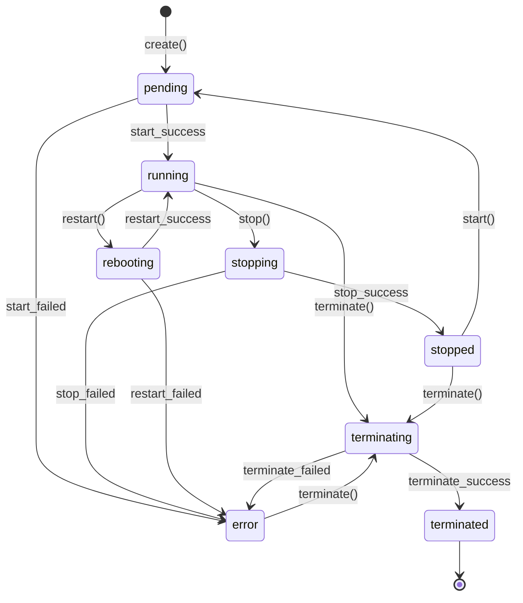

# Requirements Document

## Introduction

本專案旨在設計並實作一個 RESTful API，模擬 AWS EC2 的狀態管理行為，但底層實際操作 Docker containers。API 將提供類似 EC2 instance 的生命週期管理功能，包括建立、啟動、停止、重啟和刪除等操作，同時維護狀態轉換的一致性。

技術棧：Java 17, Spring Boot 3.x, Gradle

## Requirements

### Requirement 1

**User Story:** 作為 API 使用者，我想要能夠非同步建立新的 instance，以便不會因為長時間操作而等待

#### Acceptance Criteria

1. WHEN 使用者發送 POST /instances 請求 THEN 系統 SHALL 立即返回 202 Accepted 和 instance 資訊
2. WHEN 建立 instance 時 THEN 系統 SHALL 分配唯一的 instance ID 和 operation ID
3. WHEN 建立請求接受時 THEN instance 狀態 SHALL 設為 "pending"
4. WHEN Docker container 建立過程在背景執行時 THEN 系統 SHALL 非同步更新 instance 狀態
5. IF 建立失敗 THEN 系統 SHALL 將狀態更新為 "error" 並記錄錯誤訊息
6. WHEN 使用者想查詢操作進度時 THEN 系統 SHALL 提供 operation status 查詢端點

### Requirement 2

**User Story:** 作為 API 使用者，我想要能夠高效查詢 instance 的狀態和資訊，支援分頁和快取以提升效能

#### Acceptance Criteria

1. WHEN 使用者發送 GET /instances/{id} 請求 THEN 系統 SHALL 返回該 instance 的詳細資訊
2. WHEN 使用者發送 GET /instances 請求 THEN 系統 SHALL 支援分頁參數（page, size, sort）
3. WHEN 查詢 instances 列表時 THEN 系統 SHALL 返回分頁資訊（totalElements, totalPages, currentPage）
4. WHEN 查詢不存在的 instance THEN 系統 SHALL 返回 404 錯誤
5. WHEN 查詢成功時 THEN 回應 SHALL 包含 instance ID、狀態、建立時間、Docker container 資訊
6. WHEN 頻繁查詢相同資料時 THEN 系統 SHALL 使用快取機制提升回應速度
7. WHEN instance 狀態變更時 THEN 系統 SHALL 自動更新或清除相關快取

### Requirement 3

**User Story:** 作為 API 使用者，我想要能夠非同步啟動 instance，以便不會因為長時間操作而等待

#### Acceptance Criteria

1. WHEN 使用者發送 POST /instances/{id}/start 請求 THEN 系統 SHALL 立即返回 202 Accepted 和 operation ID
2. WHEN 啟動操作執行時 THEN instance 狀態 SHALL 從 "stopped" 轉換為 "pending"
3. WHEN Docker container 在背景成功啟動後 THEN instance 狀態 SHALL 轉換為 "running"
4. IF instance 已經在 "running" 狀態 THEN 系統 SHALL 返回 409 Conflict 錯誤
5. IF Docker container 啟動失敗 THEN instance 狀態 SHALL 轉換為 "error"
6. WHEN 使用者想查詢啟動進度時 THEN 系統 SHALL 提供 operation status 查詢

### Requirement 4

**User Story:** 作為 API 使用者，我想要能夠非同步停止 instance，以便不會因為長時間操作而等待

#### Acceptance Criteria

1. WHEN 使用者發送 POST /instances/{id}/stop 請求 THEN 系統 SHALL 立即返回 202 Accepted 和 operation ID
2. WHEN 停止操作執行時 THEN instance 狀態 SHALL 從 "running" 轉換為 "stopping"
3. WHEN Docker container 在背景成功停止後 THEN instance 狀態 SHALL 轉換為 "stopped"
4. IF instance 不在 "running" 狀態 THEN 系統 SHALL 返回 409 Conflict 錯誤
5. IF Docker container 停止失敗 THEN instance 狀態 SHALL 轉換為 "error"
6. WHEN 使用者想查詢停止進度時 THEN 系統 SHALL 提供 operation status 查詢

### Requirement 5

**User Story:** 作為 API 使用者，我想要能夠非同步重啟 instance，以便不會因為長時間操作而等待

#### Acceptance Criteria

1. WHEN 使用者發送 POST /instances/{id}/restart 請求 THEN 系統 SHALL 立即返回 202 Accepted 和 operation ID
2. WHEN 重啟操作執行時 THEN instance 狀態 SHALL 轉換為 "rebooting"
3. WHEN Docker container 在背景成功重啟後 THEN instance 狀態 SHALL 轉換為 "running"
4. IF instance 在 "pending" 或 "stopping" 狀態 THEN 系統 SHALL 返回 409 Conflict 錯誤
5. IF Docker container 重啟失敗 THEN instance 狀態 SHALL 轉換為 "error"
6. WHEN 使用者想查詢重啟進度時 THEN 系統 SHALL 提供 operation status 查詢

### Requirement 6

**User Story:** 作為 API 使用者，我想要能夠非同步刪除 instance，以便不會因為長時間操作而等待

#### Acceptance Criteria

1. WHEN 使用者發送 DELETE /instances/{id} 請求 THEN 系統 SHALL 立即返回 202 Accepted 和 operation ID
2. WHEN 刪除操作執行時 THEN instance 狀態 SHALL 轉換為 "terminating"
3. WHEN Docker container 在背景成功刪除後 THEN instance 狀態 SHALL 轉換為 "terminated"
4. IF instance 在 "pending" 或 "stopping" 狀態 THEN 系統 SHALL 等待狀態穩定後再執行刪除
5. IF Docker container 刪除失敗 THEN instance 狀態 SHALL 轉換為 "error"
6. WHEN 使用者想查詢刪除進度時 THEN 系統 SHALL 提供 operation status 查詢

### Requirement 7

**User Story:** 作為 API 使用者，我想要系統能夠正確處理狀態轉換，以便確保操作的一致性和可靠性

#### Instance 狀態機定義

系統 SHALL 實作以下狀態機制：

**狀態定義：**
- `pending`: Instance 正在初始化或啟動中
- `running`: Instance 正在運行中
- `stopping`: Instance 正在停止中
- `stopped`: Instance 已停止
- `rebooting`: Instance 正在重啟中
- `terminating`: Instance 正在終止中
- `terminated`: Instance 已終止（最終狀態）
- `error`: Instance 發生錯誤

**狀態轉換圖：**

#### Acceptance Criteria

1. WHEN Instance 建立時 THEN 初始狀態 SHALL 為 "pending"
2. WHEN 狀態轉換發生時 THEN 系統 SHALL 僅允許有效的狀態轉換
3. WHEN 嘗試無效狀態轉換時 THEN 系統 SHALL 拒絕操作並返回錯誤
4. WHEN 並發操作發生時 THEN 系統 SHALL 確保狀態轉換的原子性
5. WHEN 操作失敗時 THEN 系統 SHALL 轉換到 "error" 狀態並提供詳細錯誤資訊
6. WHEN Instance 在 "error" 狀態時 THEN 系統 SHALL 僅允許 terminate 操作
7. WHEN Instance 達到 "terminated" 狀態時 THEN 系統 SHALL 移除該 Instance 記錄
8. WHEN 系統重啟時 THEN 系統 SHALL 能夠恢復 instance 狀態與實際 Docker container 狀態的一致性

### Requirement 8

**User Story:** 作為 API 使用者，我想要能夠追蹤非同步操作的進度和狀態，以便了解操作執行情況

#### Acceptance Criteria

1. WHEN 系統接受非同步操作時 THEN 系統 SHALL 生成唯一的 operation ID
2. WHEN 使用者發送 GET /operations/{operationId} 請求 THEN 系統 SHALL 返回操作狀態和進度
3. WHEN 操作正在執行時 THEN 狀態 SHALL 為 "in_progress"
4. WHEN 操作成功完成時 THEN 狀態 SHALL 為 "completed"
5. WHEN 操作失敗時 THEN 狀態 SHALL 為 "failed" 並包含錯誤訊息
6. WHEN 操作完成後 THEN 系統 SHALL 保留操作記錄一段時間供查詢
7. WHEN 使用者查詢不存在的 operation THEN 系統 SHALL 返回 404 錯誤

### Requirement 9

**User Story:** 作為 API 使用者，我想要系統提供高效的快取機制，以便提升查詢效能和減少資源消耗

#### Acceptance Criteria

1. WHEN 查詢 instance 詳細資訊時 THEN 系統 SHALL 使用快取減少資料庫查詢
2. WHEN instance 狀態變更時 THEN 系統 SHALL 自動清除或更新相關快取
3. WHEN 查詢 instances 列表時 THEN 系統 SHALL 快取分頁結果
4. WHEN 快取資料過期時 THEN 系統 SHALL 自動重新載入最新資料
5. WHEN 系統記憶體不足時 THEN 系統 SHALL 使用 LRU 策略清除快取
6. WHEN 快取命中時 THEN 回應時間 SHALL 顯著低於資料庫查詢
7. WHEN 快取失效時 THEN 系統 SHALL 透明地從資料庫載入資料

### Requirement 10

**User Story:** 作為 API 使用者，我想要 API 提供標準的 HTTP 回應格式，以便於整合和使用

#### Acceptance Criteria

1. WHEN API 回應成功時 THEN 系統 SHALL 使用適當的 HTTP 狀態碼 (200, 201, 202, 204)
2. WHEN API 回應錯誤時 THEN 系統 SHALL 使用適當的 HTTP 狀態碼 (400, 404, 409, 500)
3. WHEN 非同步操作被接受時 THEN 系統 SHALL 返回 202 Accepted 狀態碼
4. WHEN 回應包含資料時 THEN 系統 SHALL 使用 JSON 格式
5. WHEN 發生錯誤時 THEN 回應 SHALL 包含錯誤碼和描述訊息
6. WHEN 回應成功時 THEN 回應 SHALL 包含相關的資源資訊和時間戳
7. WHEN 回應包含分頁資料時 THEN 系統 SHALL 包含分頁元資訊