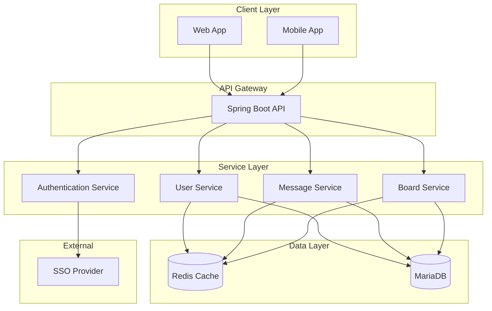

# 設計文件

## 概述

個人留言系統採用現代化的 Spring Boot 架構，提供 RESTful API 服務，支援 Web 和 Mobile App 多平台存取。系統使用 MariaDB 作為主要資料庫，Redis 作為快取層，並整合 SSO 進行身份驗證。

## 架構

### 整體架構



### 技術堆疊

- **後端框架**: Spring Boot 3.x
- **Java 版本**: Java 17
- **建置工具**: Gradle
- **資料庫**: MariaDB 10.x
- **快取**: Redis 7.x
- **身份驗證**: Spring Security + JWT
- **API 文件**: SpringDoc OpenAPI 3

## 元件與介面

### 核心元件

#### 1. Authentication Controller
- 處理 SSO 登入流程
- JWT token 生成與驗證
- 使用者 session 管理

#### 2. User Controller
- 使用者資料管理
- 使用者搜尋功能
- 個人資料更新

#### 3. Message Controller
- 留言 CRUD 操作
- 留言回覆管理
- 留言分頁查詢

#### 4. Board Controller
- 留言板檢視
- 留言板權限控制
- 留言板統計資訊

### API 介面設計

#### Authentication APIs
```
POST /api/auth/login          # SSO 登入
POST /api/auth/refresh        # Token 刷新
POST /api/auth/logout         # 登出
GET  /api/auth/profile        # 取得使用者資訊
```

#### User APIs
```
GET    /api/users             # 搜尋使用者
GET    /api/users/{id}        # 取得使用者詳情
PUT    /api/users/{id}        # 更新使用者資料
```

#### Message APIs
```
GET    /api/messages          # 取得留言列表（分頁）
POST   /api/messages          # 建立新留言
GET    /api/messages/{id}     # 取得留言詳情
PUT    /api/messages/{id}     # 更新留言
DELETE /api/messages/{id}     # 刪除留言
POST   /api/messages/{id}/replies  # 回覆留言
```

#### Board APIs
```
GET    /api/boards/{userId}   # 取得使用者留言板
GET    /api/boards/{userId}/stats  # 取得留言板統計
```

## 資料模型

### 使用者 (User)
```sql
CREATE TABLE users (
    id BIGINT PRIMARY KEY AUTO_INCREMENT,
    sso_id VARCHAR(255) UNIQUE NOT NULL,
    username VARCHAR(50) UNIQUE NOT NULL,
    email VARCHAR(255) NOT NULL,
    display_name VARCHAR(100),
    avatar_url VARCHAR(500),
    created_at TIMESTAMP DEFAULT CURRENT_TIMESTAMP,
    updated_at TIMESTAMP DEFAULT CURRENT_TIMESTAMP ON UPDATE CURRENT_TIMESTAMP,
    is_active BOOLEAN DEFAULT TRUE
);
```

### 留言 (Message)
```sql
CREATE TABLE messages (
    id BIGINT PRIMARY KEY AUTO_INCREMENT,
    user_id BIGINT NOT NULL,
    board_owner_id BIGINT NOT NULL,
    content TEXT NOT NULL,
    parent_message_id BIGINT NULL,
    created_at TIMESTAMP DEFAULT CURRENT_TIMESTAMP,
    updated_at TIMESTAMP DEFAULT CURRENT_TIMESTAMP ON UPDATE CURRENT_TIMESTAMP,
    is_deleted BOOLEAN DEFAULT FALSE,
    
    FOREIGN KEY (user_id) REFERENCES users(id),
    FOREIGN KEY (board_owner_id) REFERENCES users(id),
    FOREIGN KEY (parent_message_id) REFERENCES messages(id),
    
    INDEX idx_board_owner_created (board_owner_id, created_at),
    INDEX idx_parent_message (parent_message_id),
    INDEX idx_user_created (user_id, created_at)
);
```

### JWT Token 黑名單 (Token Blacklist)
```sql
CREATE TABLE token_blacklist (
    id BIGINT PRIMARY KEY AUTO_INCREMENT,
    token_hash VARCHAR(255) UNIQUE NOT NULL,
    expires_at TIMESTAMP NOT NULL,
    created_at TIMESTAMP DEFAULT CURRENT_TIMESTAMP,
    
    INDEX idx_expires_at (expires_at)
);
```

## 錯誤處理

### 全域異常處理器
- `@ControllerAdvice` 統一處理異常
- 標準化錯誤回應格式
- 記錄錯誤日誌

### 錯誤回應格式
```json
{
    "timestamp": "2024-01-15T10:30:00Z",
    "status": 400,
    "error": "Bad Request",
    "message": "留言內容不能為空",
    "path": "/api/messages",
    "requestId": "req-123456"
}
```

### 常見錯誤處理
- 401: 未授權存取
- 403: 權限不足
- 404: 資源不存在
- 400: 請求參數錯誤
- 500: 伺服器內部錯誤

## 快取策略

### Redis 快取設計

#### 快取鍵命名規範
```
user:{userId}                    # 使用者資訊
board:{userId}:messages         # 留言板留言列表
message:{messageId}             # 單一留言詳情
user:search:{keyword}           # 使用者搜尋結果
```

#### 快取過期時間
- 使用者資訊: 30 分鐘
- 留言板內容: 10 分鐘
- 搜尋結果: 5 分鐘
- 留言詳情: 15 分鐘

#### 快取更新策略
- Write-Through: 寫入時同步更新快取
- Cache-Aside: 讀取時檢查快取，未命中則查詢資料庫
- 資料變更時主動清除相關快取

## 安全性設計

### JWT Token 管理
- Access Token: 15 分鐘有效期
- Refresh Token: 7 天有效期
- Token 黑名單機制防止重放攻擊

### API 安全
- 所有 API 需要 JWT 驗證（除了登入端點）
- CORS 設定限制來源域名
- Rate Limiting 防止 API 濫用
- 輸入驗證防止 SQL 注入和 XSS

### 資料庫安全
- 連線池配置
- 預編譯語句防止 SQL 注入
- 敏感資料加密儲存

## 測試策略

### 單元測試
- Service 層業務邏輯測試
- Repository 層資料存取測試
- Utility 類別功能測試
- 目標覆蓋率: 80%

### 整合測試
- Controller 層 API 測試
- 資料庫整合測試
- Redis 快取整合測試
- 使用 TestContainers 進行容器化測試

### 端對端測試
- 完整使用者流程測試
- API 契約測試
- 效能測試

### 測試環境
- H2 記憶體資料庫用於單元測試
- TestContainers 用於整合測試
- 獨立測試環境用於端對端測試