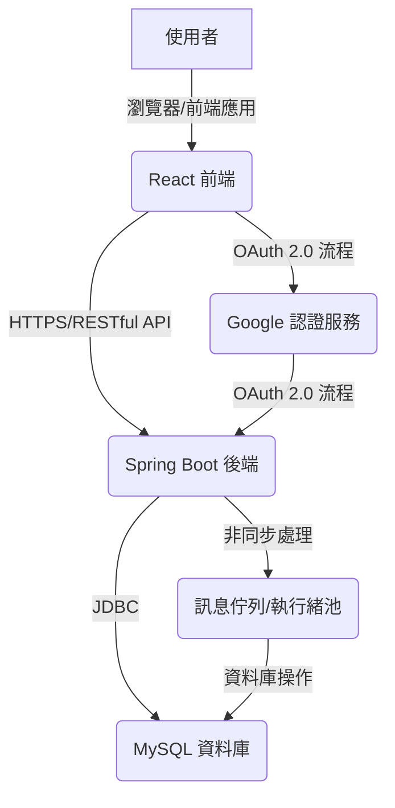

# 留言板專案設計文件

## 1. 專案架構概覽

本專案將採用前後端分離的微服務架構（或單體應用，但邏輯分離），後端提供 RESTful API，前端透過這些 API 與後端互動。



## 2. 後端設計

### 2.1 資料庫設計 (MySQL)

#### User 表

| 欄位名      | 資料型態      | 說明             |
| :---------- | :------------ | :--------------- |
| `id`        | `BIGINT`      | 主鍵，自動增長   |
| `google_id` | `VARCHAR(255)`| Google OAuth ID  |
| `name`      | `VARCHAR(255)`| 使用者名稱       |
| `email`     | `VARCHAR(255)`| 使用者 Email     |
| `created_at`| `DATETIME`    | 建立時間         |
| `updated_at`| `DATETIME`    | 更新時間         |

#### Post 表

| 欄位名      | 資料型態      | 說明             |
| :---------- | :------------ | :--------------- |
| `id`        | `BIGINT`      | 主鍵，自動增長   |
| `user_id`   | `BIGINT`      | 外鍵，關聯 User 表|
| `content`   | `TEXT`        | 貼文內容         |
| `created_at`| `DATETIME`    | 建立時間         |
| `updated_at`| `DATETIME`    | 更新時間         |


### 2.2 API 設計 (OpenAPI 3.0 規格)

```yaml
openapi: 3.0.0
info:
  title: 留言板專案 API
  version: 1.0.0
  description: 留言板應用程式的 RESTful API 規格。
servers:
  - url: /api
    description: API Server

components:
  securitySchemes:
    bearerAuth:
      type: http
      scheme: bearer
      bearerFormat: JWT

  schemas:
    AuthCallbackRequest:
      type: object
      properties:
        code:
          type: string
          description: Google OAuth 授權碼
      required:
        - code

    AuthCallbackResponse:
      type: object
      properties:
        token:
          type: string
          description: 內部 JWT Token
        user:
          $ref: '#/components/schemas/User'
      required:
        - token
        - user

    User:
      type: object
      properties:
        id:
          type: integer
          format: int64
          description: 使用者 ID
        name:
          type: string
          description: 使用者名稱
        email:
          type: string
          format: email
          description: 使用者 Email
      required:
        - id
        - name
        - email

    PostCreateRequest:
      type: object
      properties:
        content:
          type: string
          description: 貼文內容
      required:
        - content

    PostUpdateRequest:
      type: object
      properties:
        content:
          type: string
          description: 貼文內容
      required:
        - content

    PostResponse:
      type: object
      properties:
        id:
          type: integer
          format: int64
          description: 貼文 ID
        content:
          type: string
          description: 貼文內容
        authorId:
          type: integer
          format: int64
          description: 作者 ID
        authorName:
          type: string
          description: 作者名稱
        createdAt:
          type: string
          format: date-time
          description: 建立時間 (ISO 8601)
        updatedAt:
          type: string
          format: date-time
          description: 更新時間 (ISO 8601)
      required:
        - id
        - content
        - authorId
        - authorName
        - createdAt
        - updatedAt

    AsyncOperationResponse:
      type: object
      properties:
        message:
          type: string
          description: 操作狀態訊息
      required:
        - message

    ErrorResponse:
      type: object
      properties:
        timestamp:
          type: string
          format: date-time
        status:
          type: integer
          format: int32
        error:
          type: string
        message:
          type: string
        path:
          type: string
      required:
        - timestamp
        - status
        - error
        - message
        - path

paths:
  /auth/google/callback:
    post:
      summary: Google OAuth 回調處理
      description: 前端將從 Google 獲取的授權碼 (authorization code) 發送給後端，後端將其交換為 Google Access Token 和 ID Token，驗證後生成內部 JWT Token 返回給前端。
      requestBody:
        required: true
        content:
          application/json:
            schema:
              $ref: '#/components/schemas/AuthCallbackRequest'
      responses:
        '200':
          description: 成功認證並返回 JWT Token
          content:
            application/json:
              schema:
                $ref: '#/components/schemas/AuthCallbackResponse'
        '400':
          description: 無效的授權碼
          content:
            application/json:
              schema:
                $ref: '#/components/schemas/ErrorResponse'
        '500':
          description: 內部伺服器錯誤
          content:
            application/json:
              schema:
                $ref: '#/components/schemas/ErrorResponse'

  /posts:
    get:
      summary: 取得所有貼文 (公開，分頁)
      description: 取得所有公開的貼文，支援分頁。
      parameters:
        - in: query
          name: page
          schema:
            type: integer
            format: int32
            default: 0
          description: 頁碼 (從 0 開始)
        - in: query
          name: size
          schema:
            type: integer
            format: int32
            default: 10
          description: 每頁數量
      responses:
        '200':
          description: 成功取得貼文列表
          content:
            application/json:
              schema:
                type: array
                items:
                  $ref: '#/components/schemas/PostResponse'
        '500':
          description: 內部伺服器錯誤
          content:
            application/json:
              schema:
                $ref: '#/components/schemas/ErrorResponse'
    post:
      summary: 發布新貼文 (非同步)
      description: 建立一篇新的貼文。此操作為非同步，後端會立即返回 202 Accepted。
      security:
        - bearerAuth: []
      requestBody:
        required: true
        content:
          application/json:
            schema:
              $ref: '#/components/schemas/PostCreateRequest'
      responses:
        '202':
          description: 貼文請求已接受，正在處理中
          content:
            application/json:
              schema:
                $ref: '#/components/schemas/AsyncOperationResponse'
        '400':
          description: 請求內容無效 (例如：內容為空)
          content:
            application/json:
              schema:
                $ref: '#/components/schemas/ErrorResponse'
        '401':
          description: 未經授權
          content:
            application/json:
              schema:
                $ref: '#/components/schemas/ErrorResponse'
        '500':
          description: 內部伺服器錯誤
          content:
            application/json:
              schema:
                $ref: '#/components/schemas/ErrorResponse'

  /posts/me:
    get:
      summary: 取得使用者自己的貼文 (分頁)
      description: 取得當前登入使用者發布的所有貼文，支援分頁。
      security:
        - bearerAuth: []
      parameters:
        - in: query
          name: page
          schema:
            type: integer
            format: int32
            default: 0
          description: 頁碼 (從 0 開始)
        - in: query
          name: size
          schema:
            type: integer
            format: int32
            default: 10
          description: 每頁數量
      responses:
        '200':
          description: 成功取得使用者自己的貼文列表
          content:
            application/json:
              schema:
                type: array
                items:
                  $ref: '#/components/schemas/PostResponse'
        '401':
          description: 未經授權
          content:
            application/json:
              schema:
                $ref: '#/components/schemas/ErrorResponse'
        '500':
          description: 內部伺服器錯誤
          content:
            application/json:
              schema:
                $ref: '#/components/schemas/ErrorResponse'

  /posts/{id}:
    get:
      summary: 取得單一貼文
      description: 根據 ID 取得單一貼文。
      parameters:
        - in: path
          name: id
          schema:
            type: integer
            format: int64
          required: true
          description: 貼文 ID
      responses:
        '200':
          description: 成功取得貼文
          content:
            application/json:
              schema:
                $ref: '#/components/schemas/PostResponse'
        '404':
          description: 貼文不存在
          content:
            application/json:
              schema:
                $ref: '#/components/schemas/ErrorResponse'
        '500':
          description: 內部伺服器錯誤
          content:
            application/json:
              schema:
                $ref: '#/components/schemas/ErrorResponse'
    put:
      summary: 修改貼文 (非同步)
      description: 修改指定 ID 的貼文。此操作為非同步，後端會立即返回 202 Accepted。只有貼文的作者才能修改。
      security:
        - bearerAuth: []
      parameters:
        - in: path
          name: id
          schema:
            type: integer
            format: int64
          required: true
          description: 貼文 ID
      requestBody:
        required: true
        content:
          application/json:
            schema:
              $ref: '#/components/schemas/PostUpdateRequest'
      responses:
        '202':
          description: 貼文修改請求已接受，正在處理中
          content:
            application/json:
              schema:
                $ref: '#/components/schemas/AsyncOperationResponse'
        '400':
          description: 請求內容無效 (例如：內容為空)
          content:
            application/json:
              schema:
                $ref: '#/components/schemas/ErrorResponse'
        '401':
          description: 未經授權
          content:
            application/json:
              schema:
                $ref: '#/components/schemas/ErrorResponse'
        '403':
          description: 無權修改此貼文
          content:
            application/json:
              schema:
                $ref: '#/components/schemas/ErrorResponse'
        '404':
          description: 貼文不存在
          content:
            application/json:
              schema:
                $ref: '#/components/schemas/ErrorResponse'
        '500':
          description: 內部伺服器錯誤
          content:
            application/json:
              schema:
                $ref: '#/components/schemas/ErrorResponse'
    delete:
      summary: 刪除貼文 (非同步)
      description: 刪除指定 ID 的貼文。此操作為非同步，後端會立即返回 202 Accepted。只有貼文的作者才能刪除。
      security:
        - bearerAuth: []
      parameters:
        - in: path
          name: id
          schema:
            type: integer
            format: int64
          required: true
          description: 貼文 ID
      responses:
        '202':
          description: 貼文刪除請求已接受，正在處理中
          content:
            application/json:
              schema:
                $ref: '#/components/schemas/AsyncOperationResponse'
        '401':
          description: 未經授權
          content:
            application/json:
              schema:
                $ref: '#/components/schemas/ErrorResponse'
        '403':
          description: 無權刪除此貼文
          content:
            application/json:
              schema:
                $ref: '#/components/schemas/ErrorResponse'
        '404':
          description: 貼文不存在
          content:
            application/json:
              schema:
                $ref: '#/components/schemas/ErrorResponse'
        '500':
          description: 內部伺服器錯誤
          content:
            application/json:
              schema:
                $ref: '#/components/schemas/ErrorResponse'
```

### 2.3 非同步處理機制

對於貼文的寫入操作 (新增、修改、刪除)，將採用非同步處理。後端接收到請求後，會將任務放入一個訊息佇列 (例如：Spring 的 `ThreadPoolTaskExecutor` 或更進階的訊息佇列服務如 RabbitMQ/Kafka，初期可使用內建執行緒池) 中，並立即返回 `202 Accepted` 給前端。實際的資料庫操作將在後台執行緒中完成。

## 3. 前端設計 (React)

*   **元件化開發**: 採用 React 元件化思想，將 UI 拆分為可重用元件。
*   **路由管理**: 使用 React Router 進行頁面路由管理。
*   **狀態管理**: 可考慮使用 React Context API 或 Redux (如果專案規模擴大) 進行應用程式狀態管理。
*   **API 互動**: 使用 `fetch` API 或 Axios 等 HTTP 客戶端庫與後端 API 互動。
*   **認證流程**: 處理 Google OAuth 登入流程，並在本地儲存 JWT Token 以供後續 API 請求使用。
*   **頁面設計**:
    *   **登入頁**: 提供 Google 登入按鈕。
    *   **首頁/貼文列表頁**: 顯示所有公開貼文，支援分頁和載入更多。
    *   **我的貼文頁**: 顯示使用者自己的貼文，提供編輯和刪除功能。
    *   **發布貼文頁/模態框**: 提供文字輸入框發布新貼文。
    *   **編輯貼文頁/模態框**: 顯示現有貼文內容供使用者修改。

## 4. 技術選型

*   **後端**: Java 17, Spring Boot 3, Spring Security (OAuth2, JWT), Spring Data JPA, MySQL Connector/J, Gradle
*   **前端**: React, React Router, Axios (或 Fetch API), Google OAuth2 Client Library (for frontend)
*   **資料庫**: MySQL
*   **開發工具**: IntelliJ IDEA / VS Code

## 5. 部署考量

*   **容器化**: 考慮使用 Docker 將前後端應用程式容器化，便於部署和管理。
*   **CI/CD**: 建立自動化 CI/CD 流程，實現程式碼提交後的自動測試、建置和部署。
*   **環境配置**: 區分開發、測試、生產環境配置。