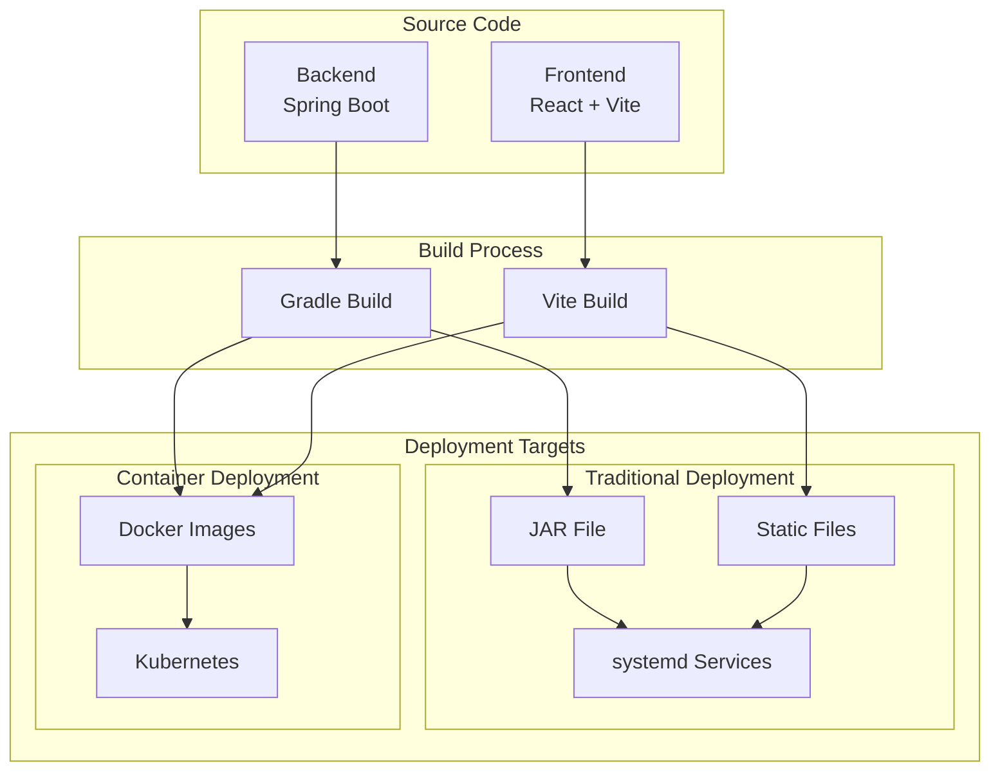
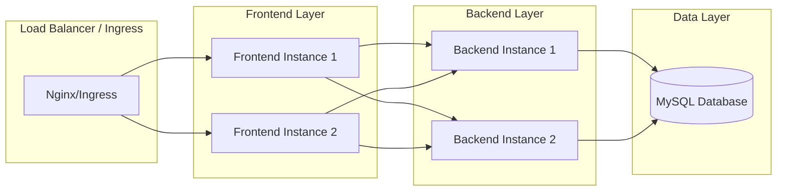

# Design Document

## Overview

本設計文檔描述了為 pgb4_login 項目（Spring Boot 後端 + React 前端）添加部署準備功能的技術方案。項目將支持兩種主要部署模式：
1. **傳統部署**：使用 systemd 在 Linux 伺服器上運行
2. **容器化部署**：使用 Docker 和 Kubernetes 進行容器化部署

技術棧分析：
- 後端：Spring Boot 3.3.2 + Java 17 + MySQL + Gradle
- 前端：React 19 + Vite + Node.js

## Architecture

### 部署架構概覽



### 系統組件架構



## Components and Interfaces

### 1. 構建系統組件

#### Backend Build Component
- **責任**：編譯 Spring Boot 應用程式，生成可執行 JAR
- **輸入**：Java 源碼、Gradle 配置
- **輸出**：可執行 JAR 文件、健康檢查端點
- **接口**：
  ```bash
  ./gradlew build
  ./gradlew bootJar
  ```

#### Frontend Build Component
- **責任**：編譯 React 應用程式，生成靜態資源
- **輸入**：React 源碼、Vite 配置
- **輸出**：優化的靜態文件（HTML、CSS、JS）
- **接口**：
  ```bash
  npm run build
  npm run preview
  ```

### 2. 部署配置組件

#### SystemD Configuration Component
- **責任**：生成 systemd 服務配置文件
- **配置文件**：
  - `pgb4-backend.service`
  - `pgb4-frontend.service`
- **功能**：自動重啟、開機啟動、日誌管理

#### Docker Configuration Component
- **責任**：定義容器化配置
- **配置文件**：
  - `backend/Dockerfile`
  - `frontend/Dockerfile`
  - `docker-compose.yml`
- **功能**：多階段構建、健康檢查、環境變數管理

#### Kubernetes Configuration Component
- **責任**：定義 K8s 部署配置
- **配置文件**：
  - `k8s/backend-deployment.yaml`
  - `k8s/frontend-deployment.yaml`
  - `k8s/services.yaml`
  - `k8s/configmap.yaml`
  - `k8s/ingress.yaml`

### 3. 自動化腳本組件

#### Build Scripts
- `scripts/build.sh`：統一構建腳本
- `scripts/test.sh`：測試執行腳本
- `scripts/package.sh`：打包腳本

#### Deployment Scripts
- `scripts/deploy-systemd.sh`：systemd 部署腳本
- `scripts/deploy-docker.sh`：Docker 部署腳本
- `scripts/deploy-k8s.sh`：Kubernetes 部署腳本

## Data Models

### 配置數據模型

#### Environment Configuration
```yaml
# config/environments/production.yml
database:
  url: ${DB_URL}
  username: ${DB_USERNAME}
  password: ${DB_PASSWORD}
  
server:
  port: ${SERVER_PORT:8080}
  
frontend:
  api_base_url: ${API_BASE_URL}
  
logging:
  level: ${LOG_LEVEL:INFO}
  file: ${LOG_FILE:/var/log/pgb4/app.log}
```

#### Docker Environment Variables
```yaml
# Backend Container
- DB_URL
- DB_USERNAME  
- DB_PASSWORD
- SERVER_PORT
- JAVA_OPTS
- SPRING_PROFILES_ACTIVE

# Frontend Container  
- API_BASE_URL
- NODE_ENV
- PORT
```

#### Kubernetes Resources
```yaml
# ConfigMap Data Structure
apiVersion: v1
kind: ConfigMap
metadata:
  name: pgb4-config
data:
  application.properties: |
    server.port=8080
    spring.datasource.url=${DB_URL}
    
# Secret Data Structure  
apiVersion: v1
kind: Secret
metadata:
  name: pgb4-secrets
type: Opaque
data:
  db-password: <base64-encoded>
  db-username: <base64-encoded>
```

## Error Handling

### 構建階段錯誤處理
1. **編譯錯誤**：
   - 檢查 Java 版本兼容性
   - 驗證依賴項完整性
   - 提供詳細錯誤日誌

2. **測試失敗**：
   - 停止構建流程
   - 生成測試報告
   - 提供失敗原因分析

### 部署階段錯誤處理
1. **服務啟動失敗**：
   - 檢查端口占用
   - 驗證配置文件
   - 檢查數據庫連接

2. **容器運行錯誤**：
   - 健康檢查失敗處理
   - 資源限制超出處理
   - 網絡連接問題診斷

3. **Kubernetes 部署錯誤**：
   - Pod 啟動失敗回滾
   - 服務發現問題處理
   - 資源配額超出處理

### 錯誤恢復策略
- **自動重試**：網絡相關錯誤自動重試 3 次
- **回滾機制**：部署失敗時自動回滾到上一個穩定版本
- **通知機制**：關鍵錯誤通過日誌和監控系統通知

## Testing Strategy

### 構建測試
1. **單元測試**：
   - 後端：JUnit + Mockito
   - 前端：Vitest + Testing Library
   
2. **集成測試**：
   - API 端點測試
   - 數據庫集成測試
   - 前後端集成測試

### 部署測試
1. **SystemD 部署測試**：
   - 服務啟動測試
   - 自動重啟測試
   - 健康檢查測試

2. **Docker 部署測試**：
   - 容器構建測試
   - 容器運行測試
   - 多容器通信測試

3. **Kubernetes 部署測試**：
   - Pod 部署測試
   - 服務發現測試
   - 負載均衡測試
   - 滾動更新測試

### 端到端測試
1. **部署後驗證**：
   - API 可用性測試
   - 前端頁面加載測試
   - 用戶登錄流程測試

2. **性能測試**：
   - 負載測試
   - 響應時間測試
   - 資源使用率測試

### 測試自動化
- **CI/CD 集成**：所有測試在部署前自動執行
- **測試報告**：生成詳細的測試報告和覆蓋率報告
- **失敗通知**：測試失敗時自動通知相關人員

## Security Considerations

### 配置安全
- 敏感信息使用環境變數或密鑰管理系統
- 配置文件權限控制（600）
- 數據庫連接加密

### 容器安全
- 使用非 root 用戶運行容器
- 最小化容器鏡像大小
- 定期更新基礎鏡像

### 網絡安全
- 使用 HTTPS/TLS 加密通信
- 配置防火牆規則
- 限制容器間網絡訪問