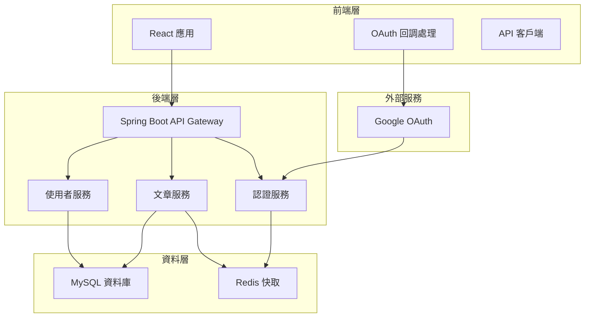

# 設計文件

## 概述

本系統採用前後端分離的微服務架構，後端使用 Spring Boot 3 提供 RESTful API，前端使用 React 構建單頁應用。系統支援 Google OAuth SSO 認證，並採用非同步處理機制處理寫入操作以提升系統效能。

## 系統架構



## 元件與介面

### 後端元件

#### 1. 認證服務 (AuthService)
- **職責**: 處理 Google OAuth 流程、JWT token 管理
- **介面**: 
  - `authenticateWithGoogle(authCode: String): AuthResponse`
  - `validateToken(token: String): UserInfo`
  - `refreshToken(refreshToken: String): AuthResponse`

#### 2. 使用者服務 (UserService)
- **職責**: 使用者資料管理、個人資料維護
- **介面**:
  - `createUser(userInfo: GoogleUserInfo): User`
  - `getUserById(userId: Long): User`
  - `updateUserProfile(userId: Long, profile: UserProfile): User`

#### 3. 文章服務 (PostService)
- **職責**: 文章 CRUD 操作、非同步處理
- **介面**:
  - `createPostAsync(userId: Long, content: String): CompletableFuture<Post>`
  - `updatePostAsync(postId: Long, userId: Long, content: String): CompletableFuture<Post>`
  - `deletePostAsync(postId: Long, userId: Long): CompletableFuture<Void>`
  - `getPostsByUser(userId: Long, pageable: Pageable): Page<Post>`
  - `getAllPosts(pageable: Pageable): Page<Post>`

### 前端元件

#### 1. 認證元件 (AuthComponent)
- **職責**: 處理登入/登出流程
- **狀態**: `isAuthenticated`, `user`, `token`

#### 2. 文章列表元件 (PostListComponent)
- **職責**: 顯示文章列表、分頁處理
- **狀態**: `posts`, `loading`, `pagination`

#### 3. 文章編輯元件 (PostEditorComponent)
- **職責**: 文章建立與編輯
- **狀態**: `content`, `isSubmitting`, `errors`

## 資料模型

### User 實體
```java
@Entity
@Table(name = "users")
public class User {
    @Id
    @GeneratedValue(strategy = GenerationType.IDENTITY)
    private Long id;
    
    @Column(unique = true, nullable = false)
    private String googleId;
    
    @Column(nullable = false)
    private String email;
    
    @Column(nullable = false)
    private String name;
    
    private String avatarUrl;
    
    @CreationTimestamp
    private LocalDateTime createdAt;
    
    @UpdateTimestamp
    private LocalDateTime updatedAt;
}
```

### Post 實體
```java
@Entity
@Table(name = "posts")
public class Post {
    @Id
    @GeneratedValue(strategy = GenerationType.IDENTITY)
    private Long id;
    
    @ManyToOne(fetch = FetchType.LAZY)
    @JoinColumn(name = "user_id", nullable = false)
    private User author;
    
    @Column(nullable = false, length = 280)
    private String content;
    
    @Column(nullable = false)
    private Boolean deleted = false;
    
    @CreationTimestamp
    private LocalDateTime createdAt;
    
    @UpdateTimestamp
    private LocalDateTime updatedAt;
}
```

## 錯誤處理

### 全域異常處理器
```java
@ControllerAdvice
public class GlobalExceptionHandler {
    
    @ExceptionHandler(ValidationException.class)
    public ResponseEntity<ErrorResponse> handleValidation(ValidationException ex) {
        return ResponseEntity.badRequest()
            .body(new ErrorResponse("VALIDATION_ERROR", ex.getMessage()));
    }
    
    @ExceptionHandler(UnauthorizedException.class)
    public ResponseEntity<ErrorResponse> handleUnauthorized(UnauthorizedException ex) {
        return ResponseEntity.status(HttpStatus.UNAUTHORIZED)
            .body(new ErrorResponse("UNAUTHORIZED", ex.getMessage()));
    }
    
    @ExceptionHandler(ForbiddenException.class)
    public ResponseEntity<ErrorResponse> handleForbidden(ForbiddenException ex) {
        return ResponseEntity.status(HttpStatus.FORBIDDEN)
            .body(new ErrorResponse("FORBIDDEN", ex.getMessage()));
    }
}
```

### 錯誤回應格式
```java
public class ErrorResponse {
    private String code;
    private String message;
    private LocalDateTime timestamp;
    private Map<String, Object> details;
}
```

## 測試策略

### 後端測試
1. **單元測試**: 使用 JUnit 5 和 Mockito 測試服務層邏輯
2. **整合測試**: 使用 @SpringBootTest 測試 API 端點
3. **資料庫測試**: 使用 @DataJpaTest 測試 Repository 層
4. **安全測試**: 測試認證和授權機制

### 前端測試
1. **元件測試**: 使用 React Testing Library 測試 UI 元件
2. **整合測試**: 測試元件間的互動
3. **E2E 測試**: 使用 Cypress 測試完整使用者流程

## OpenAPI 規格

```yaml
openapi: 3.0.3
info:
  title: Twitter-like Board API
  description: 類似 Twitter 的留言板 API
  version: 1.0.0
  contact:
    name: API Support
    email: support@example.com

servers:
  - url: http://localhost:8080/api/v1
    description: 開發環境
  - url: https://api.example.com/v1
    description: 生產環境

security:
  - BearerAuth: []

paths:
  /auth/google:
    post:
      tags:
        - Authentication
      summary: Google OAuth 認證
      description: 使用 Google OAuth 授權碼進行使用者認證
      security: []
      requestBody:
        required: true
        content:
          application/json:
            schema:
              type: object
              required:
                - authCode
              properties:
                authCode:
                  type: string
                  description: Google OAuth 授權碼
                  example: "4/0AX4XfWjE..."
      responses:
        '200':
          description: 認證成功
          content:
            application/json:
              schema:
                $ref: '#/components/schemas/AuthResponse'
        '400':
          description: 無效的授權碼
          content:
            application/json:
              schema:
                $ref: '#/components/schemas/ErrorResponse'
        '500':
          description: 伺服器錯誤
          content:
            application/json:
              schema:
                $ref: '#/components/schemas/ErrorResponse'

  /auth/refresh:
    post:
      tags:
        - Authentication
      summary: 刷新 JWT Token
      security: []
      requestBody:
        required: true
        content:
          application/json:
            schema:
              type: object
              required:
                - refreshToken
              properties:
                refreshToken:
                  type: string
                  description: 刷新 Token
      responses:
        '200':
          description: Token 刷新成功
          content:
            application/json:
              schema:
                $ref: '#/components/schemas/AuthResponse'
        '401':
          description: 無效的刷新 Token
          content:
            application/json:
              schema:
                $ref: '#/components/schemas/ErrorResponse'

  /posts:
    get:
      tags:
        - Posts
      summary: 取得文章列表
      description: 取得所有公開文章，支援分頁
      security: []
      parameters:
        - name: page
          in: query
          description: 頁碼（從 0 開始）
          schema:
            type: integer
            minimum: 0
            default: 0
        - name: size
          in: query
          description: 每頁筆數
          schema:
            type: integer
            minimum: 1
            maximum: 100
            default: 20
        - name: sort
          in: query
          description: 排序方式
          schema:
            type: string
            enum: [createdAt,desc, createdAt,asc, updatedAt,desc]
            default: createdAt,desc
      responses:
        '200':
          description: 成功取得文章列表
          content:
            application/json:
              schema:
                $ref: '#/components/schemas/PostPageResponse'

    post:
      tags:
        - Posts
      summary: 建立新文章
      description: 建立新文章（非同步處理）
      requestBody:
        required: true
        content:
          application/json:
            schema:
              $ref: '#/components/schemas/CreatePostRequest'
      responses:
        '202':
          description: 文章建立請求已接受，正在處理中
          content:
            application/json:
              schema:
                $ref: '#/components/schemas/AsyncOperationResponse'
        '400':
          description: 請求資料無效
          content:
            application/json:
              schema:
                $ref: '#/components/schemas/ErrorResponse'
        '401':
          description: 未認證
          content:
            application/json:
              schema:
                $ref: '#/components/schemas/ErrorResponse'

  /posts/{postId}:
    get:
      tags:
        - Posts
      summary: 取得單篇文章
      description: 根據文章 ID 取得文章詳情
      security: []
      parameters:
        - name: postId
          in: path
          required: true
          description: 文章 ID
          schema:
            type: integer
            format: int64
      responses:
        '200':
          description: 成功取得文章
          content:
            application/json:
              schema:
                $ref: '#/components/schemas/Post'
        '404':
          description: 文章不存在
          content:
            application/json:
              schema:
                $ref: '#/components/schemas/ErrorResponse'

    put:
      tags:
        - Posts
      summary: 更新文章
      description: 更新指定文章內容（非同步處理）
      parameters:
        - name: postId
          in: path
          required: true
          description: 文章 ID
          schema:
            type: integer
            format: int64
      requestBody:
        required: true
        content:
          application/json:
            schema:
              $ref: '#/components/schemas/UpdatePostRequest'
      responses:
        '202':
          description: 文章更新請求已接受，正在處理中
          content:
            application/json:
              schema:
                $ref: '#/components/schemas/AsyncOperationResponse'
        '400':
          description: 請求資料無效
          content:
            application/json:
              schema:
                $ref: '#/components/schemas/ErrorResponse'
        '401':
          description: 未認證
          content:
            application/json:
              schema:
                $ref: '#/components/schemas/ErrorResponse'
        '403':
          description: 無權限修改此文章
          content:
            application/json:
              schema:
                $ref: '#/components/schemas/ErrorResponse'
        '404':
          description: 文章不存在
          content:
            application/json:
              schema:
                $ref: '#/components/schemas/ErrorResponse'

    delete:
      tags:
        - Posts
      summary: 刪除文章
      description: 刪除指定文章（軟刪除，非同步處理）
      parameters:
        - name: postId
          in: path
          required: true
          description: 文章 ID
          schema:
            type: integer
            format: int64
      responses:
        '202':
          description: 文章刪除請求已接受，正在處理中
          content:
            application/json:
              schema:
                $ref: '#/components/schemas/AsyncOperationResponse'
        '401':
          description: 未認證
          content:
            application/json:
              schema:
                $ref: '#/components/schemas/ErrorResponse'
        '403':
          description: 無權限刪除此文章
          content:
            application/json:
              schema:
                $ref: '#/components/schemas/ErrorResponse'
        '404':
          description: 文章不存在
          content:
            application/json:
              schema:
                $ref: '#/components/schemas/ErrorResponse'

  /users/{userId}/posts:
    get:
      tags:
        - Posts
      summary: 取得特定使用者的文章
      description: 取得指定使用者的所有文章
      parameters:
        - name: userId
          in: path
          required: true
          description: 使用者 ID
          schema:
            type: integer
            format: int64
        - name: page
          in: query
          description: 頁碼（從 0 開始）
          schema:
            type: integer
            minimum: 0
            default: 0
        - name: size
          in: query
          description: 每頁筆數
          schema:
            type: integer
            minimum: 1
            maximum: 100
            default: 20
        - name: includeDeleted
          in: query
          description: 是否包含已刪除文章（僅限本人）
          schema:
            type: boolean
            default: false
      responses:
        '200':
          description: 成功取得使用者文章列表
          content:
            application/json:
              schema:
                $ref: '#/components/schemas/PostPageResponse'
        '404':
          description: 使用者不存在
          content:
            application/json:
              schema:
                $ref: '#/components/schemas/ErrorResponse'

  /users/me:
    get:
      tags:
        - Users
      summary: 取得當前使用者資訊
      description: 取得當前認證使用者的個人資訊
      responses:
        '200':
          description: 成功取得使用者資訊
          content:
            application/json:
              schema:
                $ref: '#/components/schemas/User'
        '401':
          description: 未認證
          content:
            application/json:
              schema:
                $ref: '#/components/schemas/ErrorResponse'

  /operations/{operationId}/status:
    get:
      tags:
        - Operations
      summary: 查詢非同步操作狀態
      description: 查詢非同步操作的執行狀態
      parameters:
        - name: operationId
          in: path
          required: true
          description: 操作 ID
          schema:
            type: string
            format: uuid
      responses:
        '200':
          description: 成功取得操作狀態
          content:
            application/json:
              schema:
                $ref: '#/components/schemas/OperationStatus'
        '404':
          description: 操作不存在
          content:
            application/json:
              schema:
                $ref: '#/components/schemas/ErrorResponse'

components:
  securitySchemes:
    BearerAuth:
      type: http
      scheme: bearer
      bearerFormat: JWT

  schemas:
    AuthResponse:
      type: object
      required:
        - accessToken
        - refreshToken
        - user
        - expiresIn
      properties:
        accessToken:
          type: string
          description: JWT 存取 Token
          example: "eyJhbGciOiJIUzI1NiIsInR5cCI6IkpXVCJ9..."
        refreshToken:
          type: string
          description: 刷新 Token
          example: "rt_1234567890abcdef"
        user:
          $ref: '#/components/schemas/User'
        expiresIn:
          type: integer
          description: Token 過期時間（秒）
          example: 3600

    User:
      type: object
      required:
        - id
        - email
        - name
        - createdAt
      properties:
        id:
          type: integer
          format: int64
          description: 使用者 ID
          example: 1
        googleId:
          type: string
          description: Google 使用者 ID
          example: "1234567890"
        email:
          type: string
          format: email
          description: 電子郵件
          example: "user@example.com"
        name:
          type: string
          description: 使用者姓名
          example: "張三"
        avatarUrl:
          type: string
          format: uri
          description: 頭像 URL
          example: "https://lh3.googleusercontent.com/..."
        createdAt:
          type: string
          format: date-time
          description: 建立時間
          example: "2024-01-01T00:00:00Z"
        updatedAt:
          type: string
          format: date-time
          description: 更新時間
          example: "2024-01-01T00:00:00Z"

    Post:
      type: object
      required:
        - id
        - author
        - content
        - createdAt
        - deleted
      properties:
        id:
          type: integer
          format: int64
          description: 文章 ID
          example: 1
        author:
          $ref: '#/components/schemas/User'
        content:
          type: string
          maxLength: 280
          description: 文章內容
          example: "這是一篇測試文章"
        deleted:
          type: boolean
          description: 是否已刪除
          example: false
        createdAt:
          type: string
          format: date-time
          description: 建立時間
          example: "2024-01-01T00:00:00Z"
        updatedAt:
          type: string
          format: date-time
          description: 更新時間
          example: "2024-01-01T00:00:00Z"

    CreatePostRequest:
      type: object
      required:
        - content
      properties:
        content:
          type: string
          minLength: 1
          maxLength: 280
          description: 文章內容
          example: "這是一篇新文章"

    UpdatePostRequest:
      type: object
      required:
        - content
      properties:
        content:
          type: string
          minLength: 1
          maxLength: 280
          description: 更新後的文章內容
          example: "這是更新後的文章內容"

    PostPageResponse:
      type: object
      required:
        - content
        - pageable
        - totalElements
        - totalPages
        - last
        - first
        - numberOfElements
        - size
        - number
      properties:
        content:
          type: array
          items:
            $ref: '#/components/schemas/Post'
        pageable:
          type: object
          properties:
            sort:
              type: object
              properties:
                sorted:
                  type: boolean
                unsorted:
                  type: boolean
            pageNumber:
              type: integer
            pageSize:
              type: integer
            offset:
              type: integer
            paged:
              type: boolean
            unpaged:
              type: boolean
        totalElements:
          type: integer
          format: int64
          description: 總筆數
        totalPages:
          type: integer
          description: 總頁數
        last:
          type: boolean
          description: 是否為最後一頁
        first:
          type: boolean
          description: 是否為第一頁
        numberOfElements:
          type: integer
          description: 當前頁筆數
        size:
          type: integer
          description: 每頁筆數
        number:
          type: integer
          description: 當前頁碼

    AsyncOperationResponse:
      type: object
      required:
        - operationId
        - status
        - message
      properties:
        operationId:
          type: string
          format: uuid
          description: 操作 ID
          example: "123e4567-e89b-12d3-a456-426614174000"
        status:
          type: string
          enum: [PENDING, IN_PROGRESS, COMPLETED, FAILED]
          description: 操作狀態
          example: "PENDING"
        message:
          type: string
          description: 狀態訊息
          example: "操作已提交，正在處理中"

    OperationStatus:
      type: object
      required:
        - operationId
        - status
        - createdAt
      properties:
        operationId:
          type: string
          format: uuid
          description: 操作 ID
        status:
          type: string
          enum: [PENDING, IN_PROGRESS, COMPLETED, FAILED]
          description: 操作狀態
        message:
          type: string
          description: 狀態訊息或錯誤訊息
        result:
          type: object
          description: 操作結果（成功時）
        error:
          type: object
          description: 錯誤詳情（失敗時）
        createdAt:
          type: string
          format: date-time
          description: 操作建立時間
        updatedAt:
          type: string
          format: date-time
          description: 狀態更新時間

    ErrorResponse:
      type: object
      required:
        - code
        - message
        - timestamp
      properties:
        code:
          type: string
          description: 錯誤代碼
          example: "VALIDATION_ERROR"
        message:
          type: string
          description: 錯誤訊息
          example: "文章內容不能為空"
        timestamp:
          type: string
          format: date-time
          description: 錯誤發生時間
          example: "2024-01-01T00:00:00Z"
        details:
          type: object
          description: 錯誤詳細資訊
          additionalProperties: true
```

## 安全考量

### 認證與授權
1. **JWT Token**: 使用 RS256 演算法簽署，包含使用者 ID 和權限資訊
2. **Token 過期**: Access Token 1小時過期，Refresh Token 30天過期
3. **CORS 設定**: 限制允許的來源域名
4. **Rate Limiting**: 實作 API 呼叫頻率限制

### 資料驗證
1. **輸入驗證**: 所有使用者輸入都需要進行驗證和清理
2. **SQL 注入防護**: 使用 JPA 參數化查詢
3. **XSS 防護**: 前端輸出時進行 HTML 編碼

### 資料保護
1. **敏感資料加密**: 使用 AES-256 加密敏感資料
2. **HTTPS**: 所有 API 通訊都使用 HTTPS
3. **資料庫連線**: 使用連線池和加密連線