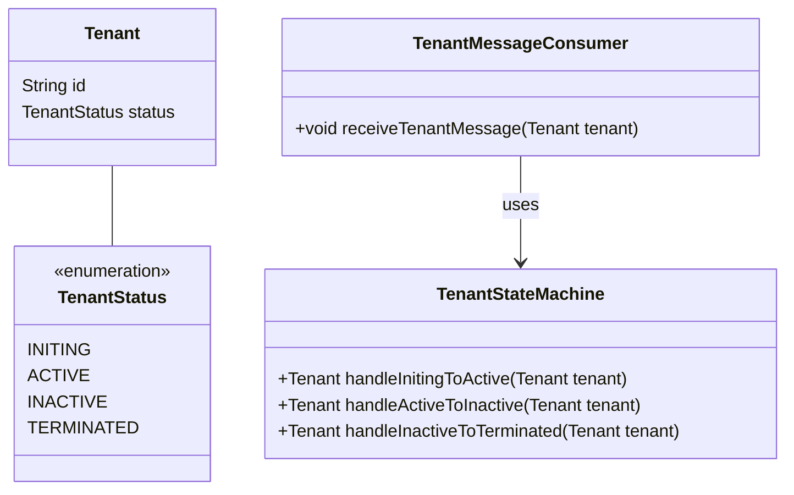
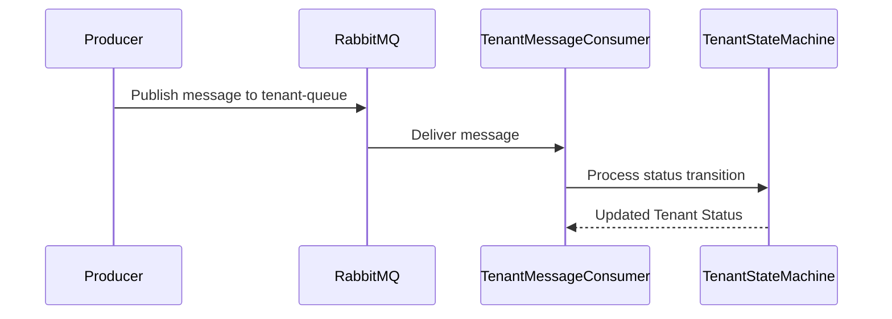

## Prompt

我想開發一個應用程式，用 java 17, springboot 3.2, gradle, rabbitmq 作為基礎。

這個應用程式處理多個資源的狀態機，每個資源透過 rabbitmq 的 queue 與 binding key 作狀態移轉，而每個 資源只會有一個 queue, 每個狀態移轉 (Transition) 的邏輯，則在程式裡面的 Consumer Handler 裡實作。

請幫我完成一個完整的程式碼框架，用以下的例子：

- 資源種類部分：
    - 有一個叫做 Tenant 的資源，起始與終止狀態為 Initing / Terminated，其他狀態還有 Active / Inactive
- 核心狀態機移轉處理架構：
    - 使用 CQRS 方式實作
    - 每個移轉 (Transition) 都透過獨立的 method 處理
- RabbitMQ 部分:
    - 每種資源類型，提供一個 Queue 與多個 binding key
    - 幫我配置好 RabbitMQ 初始設定，像是發現 Queue / Exchange 沒有建立，就自動建立
    - 未來可以透過 application.yaml 增加不同資源的 queue
- java 部分：
    - 請提供 build.gradle, 並且幫我確認都可以正常編譯
    - 請提供幾個測試，用來確保範例程式的正確性
    - 這個應用程式的 package name 叫做: com.gtcafe.app
    - 幫我完善程式碼，包含使用 lombok 簡化程式內容
- 幫我用 mermaid 畫好 class and sequence diagram.


## ChatGPT


為了完成您所描述的應用程式架構，這裡將提供一個基於 Java 17、Spring Boot 3.2、Gradle 和 RabbitMQ 的完整框架。此架構包括 `Tenant` 資源的狀態機移轉處理，並使用 CQRS 模式來實現不同狀態的移轉。以下是詳細說明：

### 1. Gradle 建置檔 (`build.gradle`)

首先，定義必要的依賴和配置。

```groovy
plugins {
    id 'java'
    id 'org.springframework.boot' version '3.2.0'
    id 'io.spring.dependency-management' version '1.1.3'
}

group = 'com.gtcafe.app'
version = '1.0.0'
sourceCompatibility = '17'

repositories {
    mavenCentral()
}

dependencies {
    implementation 'org.springframework.boot:spring-boot-starter-amqp'
    implementation 'org.springframework.boot:spring-boot-starter-web'
    implementation 'org.springframework.boot:spring-boot-starter-data-jpa'
    implementation 'org.projectlombok:lombok:1.18.26'
    compileOnly 'org.projectlombok:lombok:1.18.26'
    annotationProcessor 'org.projectlombok:lombok:1.18.26'
    testImplementation 'org.springframework.boot:spring-boot-starter-test'
}
```

### 2. RabbitMQ 配置 (`application.yaml`)

設定 RabbitMQ Queue、Exchange、Binding Key，並支援動態生成 Queue 和 Exchange 的功能。

```yaml
spring:
  rabbitmq:
    host: localhost
    port: 5672
    username: guest
    password: guest
app:
  rabbitmq:
    autoInit: true
    queues:
      tenant:
        exchange: tenant-exchange
        queueName: tenant-queue
        routingKeys:
          - initing
          - active
          - inactive
          - terminated
```

### 3. 狀態與資源類別 (`Tenant.java`)

定義 `Tenant` 資源類別，使用 Lombok 簡化代碼。

```java
package com.gtcafe.app.domain;

import lombok.AllArgsConstructor;
import lombok.Data;
import lombok.NoArgsConstructor;

@Data
@NoArgsConstructor
@AllArgsConstructor
public class Tenant {
    private String id;
    private TenantStatus status;
}

enum TenantStatus {
    INITING,
    ACTIVE,
    INACTIVE,
    TERMINATED
}
```

### 4. 狀態機邏輯 (`TenantStateMachine.java`)

實作狀態機的移轉邏輯，使用獨立方法進行處理。

```java
package com.gtcafe.app.service;

import com.gtcafe.app.domain.Tenant;
import com.gtcafe.app.domain.TenantStatus;
import org.springframework.stereotype.Service;

@Service
public class TenantStateMachine {

    public Tenant handleInitingToActive(Tenant tenant) {
        tenant.setStatus(TenantStatus.ACTIVE);
        return tenant;
    }

    public Tenant handleActiveToInactive(Tenant tenant) {
        tenant.setStatus(TenantStatus.INACTIVE);
        return tenant;
    }

    public Tenant handleInactiveToTerminated(Tenant tenant) {
        tenant.setStatus(TenantStatus.TERMINATED);
        return tenant;
    }

    // 根據需求添加其他狀態轉移
}
```

### 5. RabbitMQ 消費者處理 (`TenantMessageConsumer.java`)

建立一個 `@RabbitListener` 消費者處理狀態轉移邏輯。

```java
package com.gtcafe.app.rabbitmq;

import com.gtcafe.app.domain.Tenant;
import com.gtcafe.app.domain.TenantStatus;
import com.gtcafe.app.service.TenantStateMachine;
import org.springframework.amqp.rabbit.annotation.RabbitListener;
import org.springframework.stereotype.Component;

@Component
public class TenantMessageConsumer {

    private final TenantStateMachine stateMachine;

    public TenantMessageConsumer(TenantStateMachine stateMachine) {
        this.stateMachine = stateMachine;
    }

    @RabbitListener(queues = "#{tenantQueue.name}")
    public void receiveTenantMessage(Tenant tenant) {
        switch (tenant.getStatus()) {
            case INITING -> stateMachine.handleInitingToActive(tenant);
            case ACTIVE -> stateMachine.handleActiveToInactive(tenant);
            case INACTIVE -> stateMachine.handleInactiveToTerminated(tenant);
            // 其他狀態轉移邏輯可加入此處
        }
        // 處理完成後，將更新後的 tenant 狀態寫入其他服務或資料庫
    }
}
```

### 6. RabbitMQ 設定 (`RabbitMQConfig.java`)

配置 Queue、Exchange 和 Binding，自動創建 RabbitMQ 資源。

```java
package com.gtcafe.app.config;

import org.springframework.amqp.core.*;
import org.springframework.beans.factory.annotation.Value;
import org.springframework.context.annotation.Bean;
import org.springframework.context.annotation.Configuration;

@Configuration
public class RabbitMQConfig {

    @Value("${app.rabbitmq.queues.tenant.exchange}")
    private String exchangeName;

    @Value("${app.rabbitmq.queues.tenant.queueName}")
    private String queueName;

    @Value("${app.rabbitmq.queues.tenant.routingKeys}")
    private String[] routingKeys;

    @Bean
    public DirectExchange tenantExchange() {
        return new DirectExchange(exchangeName, true, false);
    }

    @Bean
    public Queue tenantQueue() {
        return new Queue(queueName, true);
    }

    @Bean
    public Declarables tenantBindings() {
        var bindings = new Declarables();
        for (String routingKey : routingKeys) {
            bindings.add(new Binding(queueName, Binding.DestinationType.QUEUE, exchangeName, routingKey, null));
        }
        return bindings;
    }
}
```

### 7. 測試類別 (`TenantStateMachineTest.java`)

編寫測試類別以驗證狀態機的功能。

```java
package com.gtcafe.app.service;

import com.gtcafe.app.domain.Tenant;
import com.gtcafe.app.domain.TenantStatus;
import org.junit.jupiter.api.Test;
import static org.junit.jupiter.api.Assertions.*;

class TenantStateMachineTest {

    private final TenantStateMachine stateMachine = new TenantStateMachine();

    @Test
    void testInitingToActive() {
        Tenant tenant = new Tenant("1", TenantStatus.INITING);
        Tenant updatedTenant = stateMachine.handleInitingToActive(tenant);
        assertEquals(TenantStatus.ACTIVE, updatedTenant.getStatus());
    }

    @Test
    void testActiveToInactive() {
        Tenant tenant = new Tenant("1", TenantStatus.ACTIVE);
        Tenant updatedTenant = stateMachine.handleActiveToInactive(tenant);
        assertEquals(TenantStatus.INACTIVE, updatedTenant.getStatus());
    }

    @Test
    void testInactiveToTerminated() {
        Tenant tenant = new Tenant("1", TenantStatus.INACTIVE);
        Tenant updatedTenant = stateMachine.handleInactiveToTerminated(tenant);
        assertEquals(TenantStatus.TERMINATED, updatedTenant.getStatus());
    }
}
```

### 8. 類別與時序圖 (Mermaid)

以下是類別圖與時序圖的範例：





這個框架提供了基本的狀態機邏輯和 RabbitMQ 消費者處理，每個狀態的移轉方法都被分離在 `TenantStateMachine` 類別中。透過 CQRS 模式管理各種狀態轉換邏輯，您可以輕鬆擴展以支援更多資源類型或狀態。