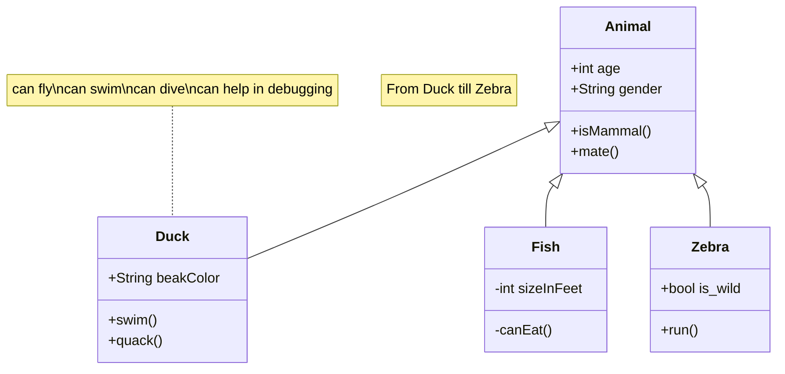

---

# Java

- synchronized
    - 具体为无锁、偏向锁、自旋锁、向OS申请重量级锁
- ReentrantLock (Java 1.5)
    - ReentrantLock实现则是通过利用CAS (CompareAndSwap)
    - 自旋机制保证线程操作的原子性和volatile保证数据可见性以实现锁的功能。
    - Spinlock
        - 廣泛應用在 linux kernel
        - Spinlock 便是實踐 Busy-waiting 的鎖。
        - spinlock 適合用來保護一段簡單的操作，設想現在我們在排隊的機台，每個人只能使用 5 秒，那根本不值得讓我們離開去做別的事情，待在原地排隊是更好的選擇。
- Semaphore
- Mutex
    - Mutex lock 便是實踐 Sleep-waiting 的鎖。
    - 相反的，Mutex lock 適合拿來保護一段區域，以排吃到飽餐廳為例，當輪到我們入場時，店家會使用電話告知。因此在這段等待的時間，我們就可以到商場周邊晃晃避免空等。

## NormalCounter

❯  cd /Users/rickhwang/Repos/rickhwang/github/java-lab/race-condition ; /usr/bin/env /Users/rickhwang/.sdkman/candidates/java/17.0.8-graalce/bin/java -XX:+ShowCodeDetailsInExceptionMessages -cp /Users/rickhwang/Library/Application\ Support/Code/User/workspaceStorage/77bf20f6fb97228cb327243c4638023e/redhat.java/jdt_ws/race-condition_477a4faa/bin RaceConditionDemo
Init counter, value: [0]
After increment: Thread: [T5], Value: [5]
After decrement: Thread: [T5], Value: [5]
After increment: Thread: [T2], Value: [6]
After decrement: Thread: [T2], Value: [6]
After increment: Thread: [T8], Value: [5]
After decrement: Thread: [T8], Value: [5]
After increment: Thread: [T0], Value: [5]
After decrement: Thread: [T0], Value: [4]
After increment: Thread: [T1], Value: [5]
After decrement: Thread: [T1], Value: [3]
After increment: Thread: [T9], Value: [5]
After decrement: Thread: [T9], Value: [2]
After increment: Thread: [T6], Value: [5]
After decrement: Thread: [T6], Value: [1]
After increment: Thread: [T7], Value: [5]
After decrement: Thread: [T7], Value: [0]
After increment: Thread: [T3], Value: [7]
After decrement: Thread: [T3], Value: [-1]
After increment: Thread: [T4], Value: [7]
After decrement: Thread: [T4], Value: [-2]
value: -2

---

## Lock with synchronized

---
## ReentrantLock

可重入鎖

---

## Reference

- https://zhuanlan.zhihu.com/p/126085068
- https://zhuanlan.zhihu.com/p/336248650
- https://www.baeldung.com/java-mutex

- https://ithelp.ithome.com.tw/articles/10281491
- https://tech.meituan.com/2019/12/05/aqs-theory-and-apply.html
- https://docs.oracle.com/javase/8/docs/api/java/util/concurrent/locks/ReentrantLock.html