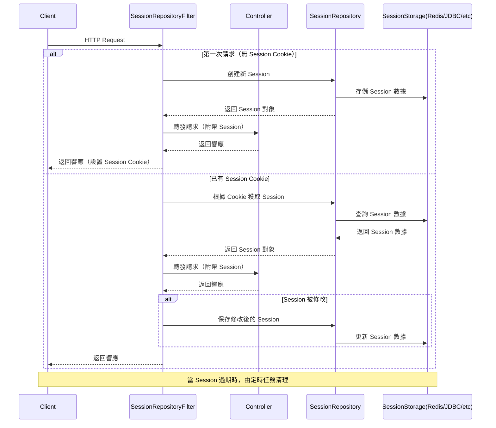

# Claude

我來為您整理 Spring Boot 3.2 中關於 session 相關的配置和用法。

## Spring Boot 3.2 中的 Session 配置

Spring Boot 3.2 提供了多種 session 相關的配置選項，可以在 application.yaml 中進行設定：

### 基本 Session 配置

```yaml
spring:
  session:
    # 存儲類型，可選值有 none, jdbc, redis, hazelcast, mongodb
    store-type: redis
    # session 超時時間，預設 30 分鐘
    timeout: 30m
    # 是否在啟動時創建 session 存儲需要的表/結構
    initialize-schema: always
    # Redis 配置
    redis:
      namespace: spring:session
      flush-mode: on-save
      cleanup-cron: "0 * * * * *"
```

### Session Cookie 配置

```yaml
server:
  servlet:
    session:
      cookie:
        # Cookie 名稱，預設 JSESSIONID
        name: MYSESSIONID
        # Cookie 持續時間，默認為 -1 (瀏覽器關閉後失效)
        max-age: 3600
        # 是否僅通過 HTTPS 傳輸
        secure: true
        # 是否僅限 HTTP 訪問（不允許 JavaScript 訪問）
        http-only: true
        # Cookie 路徑
        path: /
        # Cookie 域
        domain: example.com
        # Cookie SameSite 屬性
        same-site: lax
      # 是否持續性 session，預設 false
      persistent: false
      # 追蹤模式，可選值有 cookie(默認)、url、ssl
      tracking-modes: cookie
      # 超時時間，預設 30 分鐘
      timeout: 30m
```

### JDBC Session 配置

```yaml
spring:
  session:
    store-type: jdbc
    jdbc:
      # 初始化 schema 的模式，可為 always, embedded, never
      initialize-schema: always
      # 自定義表名前綴
      table-name: SPRING_SESSION
      # 清理過期 session 的頻率
      cleanup-cron: "0 */30 * * * *"
```

### Redis Session 配置

```yaml
spring:
  session:
    store-type: redis
    redis:
      # Redis 命名空間前綴
      namespace: spring:session
      # 刷新模式，可為 on-save 或 immediate
      flush-mode: on-save
      # 清理過期 session 的頻率
      cleanup-cron: "0 */30 * * * *"
      # 是否啟用 Redis 儲存 session 配置
      configure-action: config
```



## 使用示例

以下是一些 Spring Boot 中使用 Session 的實用範例：

### 1. 在控制器中使用 Session

```java
@RestController
public class SessionController {
    
    @GetMapping("/session-test")
    public String sessionTest(HttpSession session) {
        // 獲取 session 中的值
        String username = (String) session.getAttribute("username");
        
        if (username == null) {
            // 設置 session 值
            session.setAttribute("username", "user123");
            return "Session 已創建";
        }
        
        return "當前用戶: " + username;
    }
    
    @GetMapping("/logout")
    public String logout(HttpSession session) {
        // 使 session 失效
        session.invalidate();
        return "已登出";
    }
}
```

### 2. 分散式 Session 配置 (使用 Redis)

首先添加依賴：

```xml
<dependency>
    <groupId>org.springframework.session</groupId>
    <artifactId>spring-session-data-redis</artifactId>
</dependency>
<dependency>
    <groupId>org.springframework.boot</groupId>
    <artifactId>spring-boot-starter-data-redis</artifactId>
</dependency>
```

然後在 application.yaml 中配置：

```yaml
spring:
  session:
    store-type: redis
    timeout: 1800s
  redis:
    host: localhost
    port: 6379
```

### 3. 使用 JDBC 存儲 Session

添加依賴：

```xml
<dependency>
    <groupId>org.springframework.session</groupId>
    <artifactId>spring-session-jdbc</artifactId>
</dependency>
<dependency>
    <groupId>org.springframework.boot</groupId>
    <artifactId>spring-boot-starter-jdbc</artifactId>
</dependency>
```

配置 application.yaml：

```yaml
spring:
  session:
    store-type: jdbc
    jdbc:
      initialize-schema: always
  datasource:
    url: jdbc:mysql://localhost:3306/test
    username: root
    password: password
```

以上是 Spring Boot 3.2 中關於 session 相關配置的主要內容。序列圖展示了 Spring Session 的工作流程，包括創建新 session、獲取已有 session 以及 session 更新的過程。如果您需要更詳細的説明或者有特定的場景需求，請告訴我。

---
# ChatGPT

---

在 **Spring Boot 3.2** 中，`spring.session` 相關的設定主要用於管理 **Spring Session**，提供分佈式會話存儲的能力，支援多種存儲方式（如 Redis、JDBC、Hazelcast、MongoDB）。這裡介紹常見的 `application.yaml` 設定及其用途。

---

## **1. 通用 `spring.session` 設定**
```yaml
spring:
  session:
    store-type: redis  # 指定 session 存儲類型，可選 none, redis, jdbc, hazelcast
    timeout: 30m       # 會話超時時間（全局設定，預設 30 分鐘）
    tracking-mode: cookie  # 設定會話追蹤模式，可選 cookie, url, session
    cookie:
      name: SESSIONID  # 設定 Session Cookie 名稱
      http-only: true  # 限制 Cookie 只能透過 HTTP 存取，防止 JavaScript 讀取
      secure: false    # 是否僅限 HTTPS 傳輸
      same-site: lax   # 控制 SameSite 設定，可選 none, lax, strict
```

---

## **2. 使用 Redis 存儲 Session**
若要使用 **Redis** 來存儲 `spring.session`，可使用以下設定：
```yaml
spring:
  session:
    store-type: redis  # 指定 Redis 作為 Session 存儲
    redis:
      namespace: spring:session  # Redis 存儲 session 的 key 前綴
      flush-mode: on_save        # session 變更時才同步到 Redis
      save-mode: on_set_attribute # 只同步被修改的 attribute，可選 on_set_attribute, on_get_attribute, always
```
**相關依賴：**
```xml
<dependency>
    <groupId>org.springframework.boot</groupId>
    <artifactId>spring-boot-starter-data-redis</artifactId>
</dependency>
<dependency>
    <groupId>org.springframework.session</groupId>
    <artifactId>spring-session-data-redis</artifactId>
</dependency>
```
---

## **3. 使用 JDBC 存儲 Session**
若要將 Session 存入 **MySQL / PostgreSQL**：
```yaml
spring:
  session:
    store-type: jdbc  # 指定 JDBC 作為 Session 存儲
    jdbc:
      initialize-schema: always  # 自動建立 session 資料表
```
**相關依賴：**
```xml
<dependency>
    <groupId>org.springframework.session</groupId>
    <artifactId>spring-session-jdbc</artifactId>
</dependency>
```
**建立資料表（MySQL 範例）：**
```sql
CREATE TABLE SPRING_SESSION (
    PRIMARY_ID CHAR(36) NOT NULL,
    SESSION_ID CHAR(36) NOT NULL,
    CREATION_TIME BIGINT NOT NULL,
    LAST_ACCESS_TIME BIGINT NOT NULL,
    MAX_INACTIVE_INTERVAL INT NOT NULL,
    EXPIRY_TIME BIGINT NOT NULL,
    PRINCIPAL_NAME VARCHAR(100),
    PRIMARY KEY (PRIMARY_ID)
);
```
---

## **4. 設定 `@EnableRedisHttpSession`**
如果使用 **Redis** 存儲 Session，則需要在 Spring Boot **Configuration** 類別加上：
```java
@Configuration
@EnableRedisHttpSession
public class SessionConfig {
}
```
這樣 Spring Boot 會自動使用 Redis 來存取 `HttpSession`。

---

## **5. 自訂 Session 銷毀邏輯**
Spring Boot 允許自訂 session 銷毀事件：
```java
@Component
public class SessionDestroyedListener implements ApplicationListener<SessionDestroyedEvent> {
    @Override
    public void onApplicationEvent(SessionDestroyedEvent event) {
        System.out.println("Session destroyed: " + event.getId());
    }
}
```

---

## **6. Session 共享與 Sticky Session**
當應用部署在多個節點時，可以透過 **Redis** 來確保 Session 共享：
```yaml
server:
  servlet:
    session:
      persistent: true  # 允許 session 持久化
  session:
    timeout: 30m  # 全局 session 超時時間
```
如果 Session 需要綁定到特定的應用節點（**Sticky Session**），可確保 **負載均衡器** 設定基於 Cookie 進行流量導向，例如 Nginx 的 `ip_hash` 或 AWS ALB 的 `sticky sessions`。

---

## **7. Spring Security 整合 Session**
當 Spring Boot 整合 Spring Security 時，可以使用 `session-management` 來限制 Session：
```java
@Configuration
public class SecurityConfig {
    @Bean
    public SecurityFilterChain securityFilterChain(HttpSecurity http) throws Exception {
        http
            .sessionManagement(session -> session
                .sessionCreationPolicy(SessionCreationPolicy.IF_REQUIRED) // 需要時才創建 session
                .maximumSessions(1) // 限制每個使用者僅有一個有效 session
                .maxSessionsPreventsLogin(true) // 避免多次登入
            )
            .authorizeHttpRequests(auth -> auth.anyRequest().authenticated())
            .formLogin(Customizer.withDefaults());

        return http.build();
    }
}
```
這樣可以防止一個帳號在多個裝置上同時登入。

---

## **結論**
Spring Boot 3.2 提供了強大的 `spring.session` 設定，支援 **Redis、JDBC、Hazelcast** 等存儲方式，並可透過 `application.yaml` 設定：
- `timeout` 控制 session 過期時間
- `store-type` 決定 session 存儲方式
- `cookie` 設定 HTTP Cookie
- `flush-mode` & `save-mode` 優化 Redis 存取行為
- 可整合 Spring Security 限制 session 數量

如果你的系統是 **分散式架構**，建議使用 **Redis** 作為 Session 存儲，以確保多節點同步及高效能存取。

