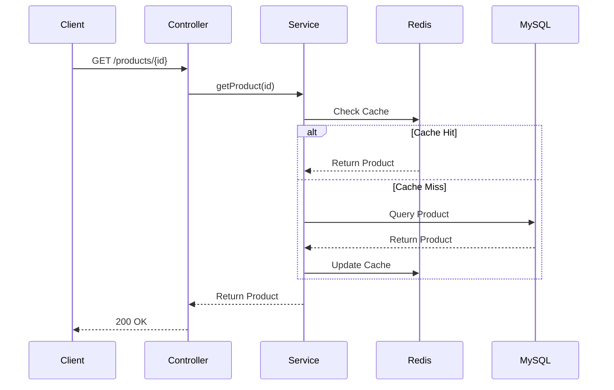

我想在 application 初始的時候，有一些 資料從 repository 讀取，放在特定的 bean 裡，幫我寫一個範例程式。

這個程式使用 java 17, springboot 3.4, gradle.

- repository 先用從 resources 目錄底下讀取一個 json 檔案.
- 如果檔案有更新的時候，則會自動重新讀取。
- 讀取的資料放在 redis 裡，所以要先有 redis server.
- 檔案的資料可以透過 api 更新，更新的時候，要同時更新 redis 裡的資料。

請提供我完整的範例程式碼。


---

以下是使用 **Java 17**, **Spring Boot 3.2**, **Gradle**, **MySQL**, 和 **Redis** 實現 Cache-Aside Pattern 的精簡範例。這個範例提供簡單的 REST API，透過 MySQL 作為資料庫並結合 Redis 作為快取。

---

### **1. 主要程式碼**
#### **Gradle 配置**
```groovy
plugins {
    id 'java'
    id 'org.springframework.boot' version '3.2.0'
    id 'io.spring.dependency-management' version '1.1.0'
}

group = 'com.example'
version = '1.0.0'

java {
    sourceCompatibility = '17'
}

dependencies {
    implementation 'org.springframework.boot:spring-boot-starter-data-jpa'
    implementation 'org.springframework.boot:spring-boot-starter-data-redis'
    implementation 'org.springframework.boot:spring-boot-starter-web'
    runtimeOnly 'mysql:mysql-connector-java'
}
```

---

#### **Entity: Product**
```java
@Entity
public class Product {
    @Id
    @GeneratedValue(strategy = GenerationType.IDENTITY)
    private Long id;

    private String name;
    private double price;

    // Getters and Setters
}
```

---

#### **Repository: ProductRepository**
```java
public interface ProductRepository extends JpaRepository<Product, Long> {
}
```

---

#### **Service: ProductService**
```java
@Service
public class ProductService {
    private final ProductRepository productRepository;
    private final RedisTemplate<String, Product> redisTemplate;

    public ProductService(ProductRepository productRepository, RedisTemplate<String, Product> redisTemplate) {
        this.productRepository = productRepository;
        this.redisTemplate = redisTemplate;
    }

    private static final String CACHE_KEY_PREFIX = "product:";

    public Product getProduct(Long id) {
        String cacheKey = CACHE_KEY_PREFIX + id;
        // 查詢快取
        Product product = redisTemplate.opsForValue().get(cacheKey);
        if (product != null) return product;

        // 查詢資料庫
        product = productRepository.findById(id).orElse(null);
        if (product != null) {
            // 更新快取
            redisTemplate.opsForValue().set(cacheKey, product);
        }
        return product;
    }

    public Product saveProduct(Product product) {
        Product savedProduct = productRepository.save(product);
        // 同步快取
        redisTemplate.opsForValue().set(CACHE_KEY_PREFIX + savedProduct.getId(), savedProduct);
        return savedProduct;
    }

    public void deleteProduct(Long id) {
        productRepository.deleteById(id);
        // 刪除快取
        redisTemplate.delete(CACHE_KEY_PREFIX + id);
    }
}
```

---

#### **Controller: ProductController**
```java
@RestController
@RequestMapping("/products")
public class ProductController {
    private final ProductService productService;

    public ProductController(ProductService productService) {
        this.productService = productService;
    }

    @GetMapping("/{id}")
    public ResponseEntity<Product> getProduct(@PathVariable Long id) {
        Product product = productService.getProduct(id);
        return product != null ? ResponseEntity.ok(product) : ResponseEntity.notFound().build();
    }

    @PostMapping
    public ResponseEntity<Product> createProduct(@RequestBody Product product) {
        return ResponseEntity.ok(productService.saveProduct(product));
    }

    @DeleteMapping("/{id}")
    public ResponseEntity<Void> deleteProduct(@PathVariable Long id) {
        productService.deleteProduct(id);
        return ResponseEntity.noContent().build();
    }
}
```

---

#### **Redis Configuration**
```java
@Configuration
public class RedisConfig {
    @Bean
    public RedisTemplate<String, Product> redisTemplate(RedisConnectionFactory connectionFactory) {
        RedisTemplate<String, Product> template = new RedisTemplate<>();
        template.setConnectionFactory(connectionFactory);
        template.setKeySerializer(new StringRedisSerializer());
        template.setValueSerializer(new Jackson2JsonRedisSerializer<>(Product.class));
        return template;
    }
}
```

---

### **2. Sequence Diagram**



---

### **測試 API**
1. **新增商品**
   ```bash
   curl -X POST -H "Content-Type: application/json" \
   -d '{"name":"Laptop", "price":1500}' http://localhost:8080/products
   ```

2. **查詢商品**
   ```bash
   curl http://localhost:8080/products/1
   ```

3. **刪除商品**
   ```bash
   curl -X DELETE http://localhost:8080/products/1
   ```