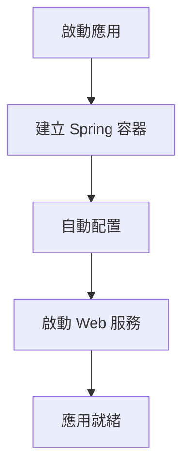
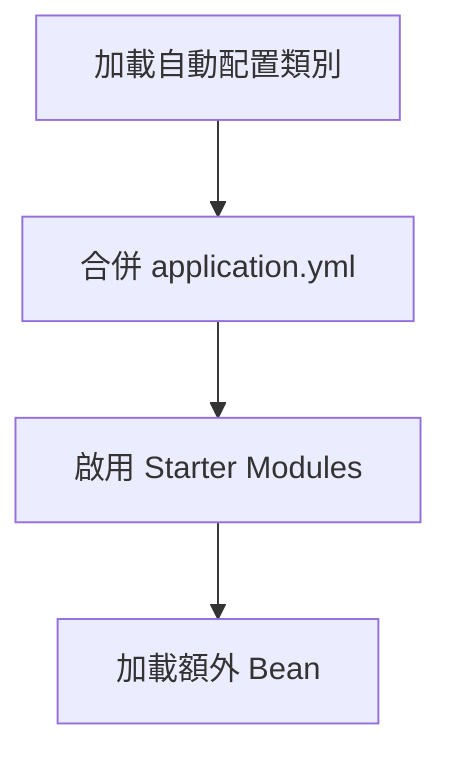
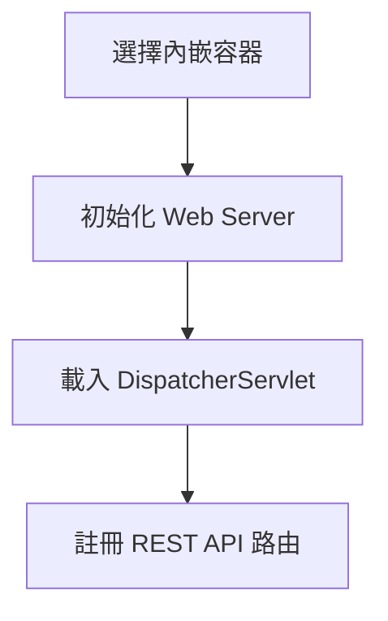
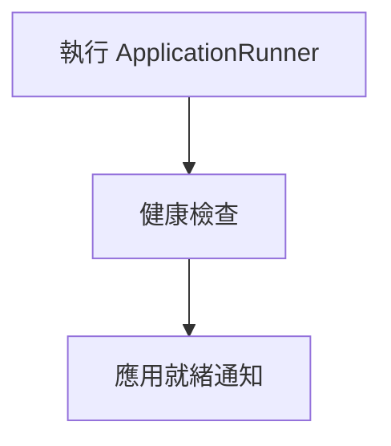

## ChatGPT

### Spring Boot 3.4 初始化流程摘要 (以 REST API 應用為例)

Spring Boot 3.4 的初始化流程可以分為高階流程與細節區塊：
1. **高階流程**:
   - **啟動應用**：包括 JVM 啟動與主方法執行。
   - **建立 Spring 容器**：加載 Spring 應用上下文，註冊 Bean 定義。
   - **自動配置 (Auto-Configuration)**：Spring Boot 預設的自動配置與使用者自訂配置結合。
   - **啟動 Web 服務**：內嵌 Web Server 啟動，載入 REST API 的路由與過濾器。
   - **應用就緒**：SpringBoot 應用準備接收請求。

2. **細節展開區塊**：
   - **啟動應用**：使用者提供 `main` 方法，Spring Boot 負責執行。
   - **建立 Spring 容器**：Bean 定義、依賴注入 (DI)。
   - **自動配置**：預設的 Starter 和 User 自訂的配置 (e.g., `application.yml`)。
   - **內嵌 Web Server**：如 Tomcat 或 Jetty 的初始化與監聽。
   - **應用就緒**：包括健康檢查、`ApplicationRunner` 執行等。

以下是 **高階流程圖** 和 **細節展開流程圖**。

---

### High-Level Flow (Mermaid Diagram)



#### 註記：
- **Spring Boot 自動執行**: B, C, D
- **使用者可調整**: A (`main` 方法), E (`ApplicationRunner` 或 Listener)

---

### 展開區塊：Spring 容器初始化細節

```mermaid
flowchart TD
    B1[讀取 ApplicationContext] --> B2[掃描 Component]
    B2 --> B3[加載 Bean 定義]
    B3 --> B4[進行依賴注入 (DI)]
    B4 --> B5[初始化 Lifecycle Beans]
```

#### 註記：
- **Spring Boot 自動執行**: B1, B2, B3, B4
- **使用者可調整**: B5 (自定義 Beans 的初始化順序)

---

### 展開區塊：自動配置細節



#### 註記：
- **Spring Boot 自動執行**: C1, C3
- **使用者可調整**: C2 (修改 `application.yml`), C4 (定義自訂 Bean 或排除預設 Bean)

---

### 展開區塊：內嵌 Web Server 啟動



#### 註記：
- **Spring Boot 自動執行**: D1, D2, D3
- **使用者可調整**: D4 (定義 Controller 與路由)

---

### 展開區塊：應用就緒



#### 註記：
- **Spring Boot 自動執行**: E2
- **使用者可調整**: E1 (定義 `ApplicationRunner`), E3 (發送通知邏輯) 

---

### 說明
這些流程幫助清楚理解哪些是 Spring Boot 提供的自動化能力，哪些部分使用者可以透過配置或程式碼調整來改變預設行為。